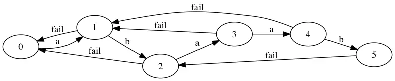

# 哈希


# trie(字典树)

边代表字母，节点路径表示一个字符串


## 模板

将一个字符串从前往后一个字符一个字符插入。

```cpp
struct trie {
  int nex[100000][26], cnt;
  bool exist[100000];  // 该结点结尾的字符串是否存在
  void insert(char *s, int l) {  // 插入字符串
    int p = 0;
    for (int i = 0; i < l; i++) {
      int c = s[i] - 'a';
      if (!nex[p][c]) nex[p][c] = ++cnt;  // 如果没有，就添加结点
      p = nex[p][c];
    }
    exist[p] = 1;
  }
  bool find(char *s, int l) {  // 查找字符串
    int p = 0;
    for (int i = 0; i < l; i++) {
      int c = s[i] - 'a';
      if (!nex[p][c]) return 0;
      p = nex[p][c];
    }
    return exist[p];
  }
};
```


## 应用

### 检索字符串

字典树最基础的应用——查找一个字符串是否在“字典”中出现过。

模板题 [于是他错误的点名开始了](https://www.luogu.com.cn/problem/P2580)（用map应该也可以直接写过去的。


```cpp
#include <bits/stdc++.h>

using namespace std;
typedef long long ll; 
const int N = 1e6 + 10;
const int mod = 998244353;

struct trie {
    int nex[N][30], cnt;
    int exist[N];

    void inisert(char *s, int l) {
        int p = 0;
        for(int i=0; i<l; i++) {
            int c = s[i] - 'a';
            if(!nex[p][c]) nex[p][c] = ++cnt;
            p = nex[p][c];
        }
        exist[p]++;
    }
    int find(char *s, int l) {
        int p = 0;
        for(int i=0; i<l; i++) {
            int c = s[i] - 'a'; 
            if(!nex[p][c]) return 0;
            p = nex[p][c];
        }
        return exist[p];
    }
} t;
char ch[N];
int main() {
#ifndef ONLINE_JUDGE
    freopen("in.txt", "r", stdin);
    freopen("out.txt", "w", stdout);
#endif
    int n, len;
    cin >> n;
    for(int i=1; i<=n; i++) {
        cin >> ch;
        t.inisert(ch, strlen(ch));
    }
    int m;
    cin >> m;
    for(int i=1; i<=m; i++) {
        cin >> ch;
        len = t.find(ch, strlen(ch));
        if(len == 0) {
            puts("WRONG");
        }
        else if(len == 1) {
            puts("OK");
            t.inisert(ch, strlen(ch));
        }
        else {
            puts("REPEAT");
        }
    }
}
```


### 维护异或极值

模板题 [BZOJ1954 最长异或路径](https://www.luogu.com.cn/problem/P4551)


 先用dfs找到每个节点到根节点的异或和，然后再对枚举每个节点，在字典树上找到异或值最大的一个节点值。

```cpp
#include <bits/stdc++.h>

using namespace std;
const int N = 2e6+10;
typedef long long ll;
// #define int long long
int head[N], to[N], nex[N], wei[N], cnt = 0;

void add(int x, int y, int w) {
    to[cnt] = y;
    wei[cnt] = w;
    nex[cnt] = head[x];
    head[x] = cnt++;
}
int val[N];
void dfs(int now, int f, int v) {
    val[now] = v;
    for(int i=head[now]; ~i; i=nex[i]) {
        int t = to[i];
        if(t == f) continue;
        dfs(t, now, v^wei[i]);
    }
}
struct trie{
    int ne[N][2], tot;
    int exit[N];
    
    void insert(int x) {
        int p = 0;
        for(int i=31; i>=0; i--) {
            int c = ((x>>i) & 1);
            if(!ne[p][c]) ne[p][c] = ++tot;
            p = ne[p][c];
            exit[p]++;
        }
    }
    int query(int x) {
        int p = 0, ans = x;
        for(int i=31; i>=0; i--) {
            int c = ((x>>i) & 1);
            int u = ne[p][c], v = ne[p][!c];
            if(!u && !v) return ans; 
            if(c == 1) {
                if(v && exit[v]) p = v;
                else if(u){
                    p = u;
                    ans ^= (1<<i);
                }
            }
            else {
                if(v && exit[v]) {
                    ans ^= (1<<i);
                    p = v;
                }
                else if(u) p = u;
            }
        }
        return ans;
    }
} T;
int main() {
#ifndef ONLINE_JUDGE
    freopen("in.txt", "r", stdin);
    freopen("out.txt", "w", stdout);
#endif
    memset(head, -1, sizeof head);
    int n, a, b, c;
    cin >> n;
    for(int i=1; i<n; i++) {
        cin >> a >> b >> c;
        add(a, b, c);
        add(b, a, c);
    }
    dfs(1, -1, 0);
    int mx = 0;
    for(int i=1; i<=n; i++) {
        mx = max(val[i], mx);
        mx = max(T.query(val[i]), mx);
        T.insert(val[i]);
    }
    cout << mx << endl;
}
```


### 01trie维护异或和


题意

初始有一个空数组，现有两种操作：

1. 向数组中插入一个数字
2. 数组中的所有数字+1

给出 n 个操作，输出每次操作后整个数组的异或和。


$nex[i][0],nex[i][1]$：存放了i号节点的左右儿子节点的编号。

$w[i]$：子树大小

$val[i]$：表示以i为根节点的子树所产生的异或和是多少


按二进制从后往前插入，插入到最后一个位置（设置限定长度mxlen，再往上回溯更新w和val数组。


```CPP
const int mxlen = 21;
const int N = 1e5;
struct trie {
	int nex[N*mxlen][2], w[N*mxlen], val[N*mxlen], cnt;
    
    
    void updata(int now) {
		w[now] = val[now] = 0;
        w[now] = w[nex[now][0]] + w[nex[now][1]];
        if(nex[now][0]) val[now] ^= (val[nex[now][0]] << 1);
        if(nex[now][1]) val[now] ^= (val[nex[now][1]] << 1) | (w[nex[now][1]] & 1);
        w[now] &= 1; 
    }
    
    void insert(int &now, int x, int dp) {
		if(!now) {
            ++cnt;
            nex[cnt][1] = nex[cnt][0] = w[cnt] = val[cnt] = 0;
            now = cnt;
        }
        if(dp > mxlen) {
			w[now]++;
            return ;
        }
        insert(nex[now][x & 1], x >> 1, dp+1);
        updata(now);
    }
    
    void erase(int now, int x, int dp) {
		if(dp > mxlen) {
			w[now]--;
            return ;
        }
        erase(nex[now][x & 1], x>>1, dp+1);
        updata(now);
    }
    
    void addall(int now) {
		  swap(nex[now][0], nex[now][1]);
        if(nex[now][0]) addall(nex[now][0]);
        updata(now);
    }
} t;

```


**函数作用**

**updata(now):** now当前节点编号；

根据w数组和val数组的含义，得到对于节点i的w[i],val[i]


**insert(now, x, dp)**:now当前节点编号，x要插入的值，dp深度。（按二进制，从后往前插入。

递归插入，在递归过程中将nex数组赋值，


**erase(now, x, dp)**:

按x的二进制表示将路径上的w[i]--(因为是自下而上更新，所以只需要将叶子节点减一，就能更新整颗树)


**addall(now):**

交换$nex[now][0],nex[now][1]$的值，也就是当前节点左右儿子的编号，一直递归到没有1儿子的时候结束。


****


```cpp
struct trie {
  int nex[100000][26], cnt;
  bool exist[100000];  // 该结点结尾的字符串是否存在

  void insert(char *s, int l) {  // 插入字符串
    int p = 0;
    for (int i = 0; i < l; i++) {
      int c = s[i] - 'a';
      if (!nex[p][c]) nex[p][c] = ++cnt;  // 如果没有，就添加结点
      p = nex[p][c];
    }
    exist[p] = 1;
  }
  bool find(char *s, int l) {  // 查找字符串
    int p = 0;
    for (int i = 0; i < l; i++) {
      int c = s[i] - 'a';
      if (!nex[p][c]) return 0;
      p = nex[p][c];
    }
    return exist[p];
  }
};

```


## 题目


### [P4551 最长异或路径](https://www.luogu.com.cn/problem/P4551)

 ```cpp
 #include <bits/stdc++.h>
 
 using namespace std;
 const int N = 2e6+10;
 typedef long long ll;
 // #define int long long
 int head[N], to[N], nex[N], wei[N], cnt = 0;
 
 void add(int x, int y, int w) {
     to[cnt] = y;
     wei[cnt] = w;
     nex[cnt] = head[x];
     head[x] = cnt++;
 }
 int val[N];
 void dfs(int now, int f, int v) {
     val[now] = v;
     for(int i=head[now]; ~i; i=nex[i]) {
         int t = to[i];
         if(t == f) continue;
         dfs(t, now, v^wei[i]);
     }
 }
 struct tire{
     int ne[N][2], tot;
     int exit[N];
     
     void insert(int x) {
         int p = 0;
         for(int i=31; i>=0; i--) {
             int c = ((x>>i) & 1);
             if(!ne[p][c]) ne[p][c] = ++tot;
             p = ne[p][c];
             exit[p]++;
         }
     }
     int query(int x) {
         int p = 0, ans = x;
         for(int i=31; i>=0; i--) {
             int c = ((x>>i) & 1);
             int u = ne[p][c], v = ne[p][!c];
             if(!u && !v) return ans; 
             if(c == 1) {
                 if(v && exit[v]) p = v;
                 else if(u){
                     p = u;
                     ans ^= (1<<i);
                 }
             }
             else {
                 if(v && exit[v]) {
                     ans ^= (1<<i);
                     p = v;
                 }
                 else if(u) p = u;
             }
         }
         return ans;
     }
 } T;
 int main() {
 #ifndef ONLINE_JUDGE
     freopen("in.txt", "r", stdin);
     freopen("out.txt", "w", stdout);
 #endif
     memset(head, -1, sizeof head);
     int n, a, b, c;
     cin >> n;
     for(int i=1; i<n; i++) {
         cin >> a >> b >> c;
         add(a, b, c);
         add(b, a, c);
     }
     dfs(1, -1, 0);
     int mx = 0;
     for(int i=1; i<=n; i++) {
         mx = max(val[i], mx);
         mx = max(T.query(val[i]), mx);
         T.insert(val[i]);
     }
     cout << mx << endl;
 }
 
 ```


# KMP


## next数组($\pi$数组)

含义：最长公共真前后缀

求法：

```cpp
//从0开始
string s;
int len = s.size();
for(int i=1, j=0; i<len; i++) {
	while(j && s[i] != s[j]) j = pi[j-1];
    if(s[i] == s[j]) j++;
    pi[i] = j;
}

//从1开始
string s;
s = ' ' + s;
int len = s.size();
for(int i=2, j=0; i<len; i++) {
	while(j && (s[i] != s[j+1] || j+1 == len)) j = pi[j];
    if(t[j+1] == t[i]) j++;
    pi[i] = j;
}
```


## kmp自动机

含义：一个有向图，每个节点表示一个状态（kmp自动机表示的状态是最长公共真前后缀，每条边表示一个读入的字符，可以转移到下一个状态。



$$

$$
我理解的自动机都可以这么看：$\delta(u,v)$表示在u这个状态下通过v这条边转移到的状态。

同样的：kmp自动机的$\delta(u,v)$表示在最长公共前后缀是u的状态下添加v这个字符能够得到的最长公共前后缀

构建自动机的转移公式：（其中i表示长度）
$$ {在从1开始的字符串中}
\delta(i,c)=
\begin{cases}
i+1&s[i+1]=c\\
0&s[i+1]\ne c\and i=0\\
\delta(\pi(i),c)&s[i+1]\ne c\and i>0
\end{cases}
$$


```cpp
/*case1
在从0开始的字符串中
对应上面的kmp自动机含义：我们i表示长度，c表示要加入的字符，因为字符串从0开始s[长度]等价于s[i+1]。
*/
string s;
int len = s.size();
int delta[N][30];
for(int i=0; i<=len; i++) {
	for(int c=0; c<26; c++) {
        int j = i;
        while(j && s[i] != s[j]) j = pi[j-1];
        if(s[i] == s[j]) j++;
        delta[i][c] = j;
    }
}
/*case2
从0开始的字符串
对应上面的转移方程：其中i还是表示长度
*/
string s;
int len = s.size();
int delta[N][30];
for(int i=0; i<len ;i++) {
    for(int c=0; c<26; c++) {
		
        
        if(i > 0 && 'a' + c != s[i]) delta[i][c] = delta[pi[i]][c];
        else delta[i][c] = i + ('a'+c == s[i]);
    }
}
/*case3
从1开始的字符串
*/
string s;
s = ' ' + s;
int delta[N][30], len = s.size();
for(int i=1; i<len; i++) {
	for(int c=0; c<26; c++) {
        int j = i;
        while(j && ('a'+c != s[j+1] || j+1 == len)) j = pi[j];
        if('a'+c == s[j+1]) j++;
        delta[i][c] = j;
    }
}
/*csae4
*/
string s;
s = ' ' + s;
int delta[N][30], len = s.size();
for(int i=1; i<len; i++) {
    for(int c=0; c<26; c++) {
		if(i > 1 && 'a' + c != s[i+1]) delta[i][c] = delta[pi[i]][c];
        else delta[i][c] = (i-1) + ('a' + c == s[i+1]);
    }
}
```


## 题目：

### [*G. Anthem of Berland](https://codeforces.com/contest/808/problem/G)


```cpp
#include<bits/stdc++.h>
using namespace std;
typedef long long ll;
// #define int long long
// #define int __int128 
const int N = 1e5+10;
char s[N], t[N];
ll pi[N], nex[N][26];
int main() {
#ifndef ONLINE_JUDGE
    freopen("in.txt", "r", stdin);
    freopen("out.txt", "w", stdout);
#endif
    cin >> s+1 >> t+1;
    int n = strlen(s+1), m = strlen(t+1);
    if(m > n) {
        puts("0");
        return 0;
    }
    for(int i=2, j=0; i<=m; i++) {
        while(j && (t[j+1] != t[i] || j == m)) j = pi[j];
        if(t[j+1] == t[i]) j++;
        pi[i] = j;
    }
    for(int i=0; i<=m; i++) {
        for(int c=0, j; c<26; c++) {
            j = i;
            while(j && (j == m || 'a'+c != t[j+1])) j = pi[j];
            if(t[j+1] == 'a'+c) j++;
            nex[i][c] = j;
        }
    }
    ll dp[m+10][n+10];
    memset(dp, 128, sizeof dp);
    dp[0][0] = 0;
    for(int j=0, Nex; j<n; j++) {
        for(int i=0; i<=m; i++) {
            if(dp[i][j] < 0) continue;
            if(s[j+1] == '?') {
                for(int c=0; c<26; c++) {
                    Nex = nex[i][c];
                    dp[Nex][j+1] = max(dp[Nex][j+1], dp[i][j]+(Nex==m));
                }
            }
            else {
                Nex = nex[i][s[j+1]-'a'];
                dp[Nex][j+1] = max(dp[Nex][j+1], dp[i][j]+(Nex==m));
            }
        }
    }
    ll ans = 0;
    for(int i=0; i<=m; i++) {
        ans = max(ans, dp[i][n]);
    }
    printf("%d", ans);
}
```


### [D. MUH and Cube Walls](https://codeforces.com/problemset/problem/471/D)


```cpp
#include <bits/stdc++.h>
#define lson rt<<1
#define rson rt<<1|1

using namespace std;
typedef long long ll;
const int N = 2e6+10;
const int mod = 998244353;
int a[N], b[N];
vector<int> x, y;
int pi[N];
int main() {
#ifndef ONLINE_JUDGE
    freopen("in.txt", "r", stdin);
    freopen("out.txt", "w", stdout);
#endif
    int n, w;
    cin >> n >> w;
    for(int i=1; i<=n; i++) {
        cin >> a[i];
        if(i > 1) x.push_back(a[i] - a[i-1]);
    }
    for(int i=1; i<=w; i++) {
        cin >> b[i];
        if(i > 1) y.push_back(b[i] - b[i-1]);
    }
    if(n < w) {
        cout << 0 << endl;
    }
    else if(w == 1) {
        cout << n << endl;
    }
    else {
        y.push_back(1000000007);
        int len = y.size(), ans = 0;
        y.insert(y.end(), x.begin(), x.end());
        for(int i=1, j=0; i<y.size(); i++) {
            while(j && y[i] != y[j]) j = pi[j-1];
            if(y[i] == y[j]) j++;
            pi[i] = j;
            if(i > len && pi[i] == len-1) ans++;
        }
        cout << ans << endl;
    }
}
```


# AC自动机

## 用途：

多模式串匹配


## 自动机含义：

匹配以当前字母结尾的状态下，能够和它的后缀匹配的最长前缀。

nex数组：$nex[p][c]$在字典树建立的时候就已经有值了，所以用fail指向和当前状态匹配的最长前缀的编号，否则直接指向当前状态匹配的最长前缀的编号。

fail数组：辅助$nex[p][c]$这个自动机


## 题目

### [P3808 【模板】AC自动机（简单版）](https://www.luogu.com.cn/problem/P3808)


```cpp
#include<bits/stdc++.h>
using namespace std;
const int N = 5e6+10;
string x;
int nex[N][28], val[N], cnt;
void insert() {
    int p = 0;
    for(auto it : x) {
        int c = it-'a';
        if(!nex[p][c]) nex[p][c] = ++cnt;
        p = nex[p][c];
    }
    val[p]++;
}
int fail[N];
void bfs() {
    queue<int> q;
    for(int i=0; i<26; i++) {
        if(nex[0][i]) q.push(nex[0][i]);
    }
    while(!q.empty()) {
        int u = q.front(); q.pop();
        for(int i=0; i<26; i++) {
            if(nex[u][i]) fail[nex[u][i]] = nex[fail[u]][i], q.push(nex[u][i]);
            else nex[u][i] = nex[fail[u]][i];
        }
    }
}
int query() {
    int len = x.size(), u = 0, ans = 0;
    for(int i=0; i<len; i++) {
        u = nex[u][x[i]-'a'];
        for(int j=u; j && val[j] != -1; j = fail[j]) {
            ans += val[j], val[j] = -1;
        }
    }
    return ans;
}
int main() {
#ifndef ONLINE_JUDGE
    freopen("in.txt", "r", stdin);
    freopen("out.txt", "w", stdout);
#endif
    int n;
    cin >> n;
    for(int i=1; i<=n; i++) {
        cin >> x;
        insert();
    }
    bfs();
    cin >> x;
    cout << query();
    return 0;
}
```


### [P3796 【模板】AC自动机（加强版）](https://www.luogu.com.cn/problem/P3796)


```cpp
#include <bits/stdc++.h>

using namespace std;
const int N = 2e2+10;
const int M = 1e6+10;
string s[N], t;
int nex[M][26], val[M], cnt;
map<int, string> mp;
map<int, int> xx;
void insert(string a) {
    int p = 0;
    for(int i=0; i<a.size(); i++) {
        int c = a[i] - 'a';
        if(!nex[p][c]) nex[p][c] = ++cnt;
        p = nex[p][c];
    }
    mp[p] = a;
    val[p]++;
}

int fail[M];
void bfs() {
    queue<int> q;
    for(int i=0; i<26; i++) {
        if(nex[0][i]) q.push(nex[0][i]);
    }
    while(q.size()) {
        int u = q.front(); q.pop();
        for(int i=0; i<26; i++) {
            if(nex[u][i]) fail[nex[u][i]] = nex[fail[u]][i], q.push(nex[u][i]);
            else nex[u][i] = nex[fail[u]][i];
        }
    }
}
void query(string x) {
    int p = 0;
    for(int i=0; i<x.size(); i++) {
        p = nex[p][x[i]-'a'];
        for(int j=p; j; j=fail[j]) {
            // cout << j << ' ';
            if(val[j] > 0) xx[j]++;
        }
    }
    // cout << endl;
    int mx = 0;
    for(auto it : mp) {
        mx = max(xx[it.first], mx);
    }
    cout << mx << endl;
    for(auto it : mp) {
        // cout << it.first << ' ' << it.second <<  ' ' << xx[it.first] << endl;
        if(xx[it.first] == mx) cout << it.second << endl;
    }
}
int main() {
#ifndef ONLINE_JUDGE
    freopen("in.txt", "r", stdin);
    freopen("out.txt", "w", stdout);
#endif
    int n;
    while(scanf("%d", &n), n) {
        memset(nex, 0, sizeof nex);
        memset(val, 0, sizeof val);
        memset(fail, 0, sizeof fail);
        cnt = 0;
        mp.clear();xx.clear();
        for(int i=1; i<=n; i++) {
            cin >> s[i];
            insert(s[i]);
        }
        bfs();
        cin >> t;
        query(t);
    }
}
```


### [P2292 [HNOI2004]L语言](https://www.luogu.com.cn/problem/P2292)


```cpp
#include<bits/stdc++.h>
using namespace std;
const int N = 2e6+10;
int nex[N][26], val[N], cnt;
char s[N], x[N];
void insert() {
    int len = strlen(s);
    int p = 0;
    for(int i=0; i<len; i++) {
        int c = s[i] - 'a';
        if(!nex[p][c]) nex[p][c] = ++cnt;
        p = nex[p][c]; 
    }
    val[p] = len;
}
int fail[N];
void bfs() {
    queue<int> q;
    for(int i=0; i<26; i++) {
        if(nex[0][i]) q.push(nex[0][i]);
    }
    while(q.size()) {
        int u = q.front(); q.pop();
        for(int i=0; i<26; i++) {
            if(nex[u][i]) fail[nex[u][i]] = nex[fail[u]][i], q.push(nex[u][i]);
            else nex[u][i] = nex[fail[u]][i];
        }
    }
}
int vis[N];
int query() {
    memset(vis, 0, sizeof vis);
    int ans = 0, len = strlen(x);
    vis[0] = 1;
    for(int i=0, j=0; i<len; i++) {
        j = nex[j][x[i]-'a'];
        int p = j;
        while(p) {
            if(vis[i-val[p]+1]) {
                vis[i+1] = 1;
                break;
            }
            p = fail[p];
        }
        if(vis[i+1]) ans = i+1;
    }
    return ans;
}
int main() {
#ifndef ONLINE_JUDGE
    freopen("in.txt", "r", stdin);
    freopen("out.txt", "w", stdout);
#endif
    // ios_base::sync_with_stdio(false);
    int n, m;
    scanf("%d%d", &n, &m);
    for(int i=1; i<=n; i++) {
        scanf("%s", s);
        insert();
    }
    bfs();
    while(m--) {
        scanf("%s", x);
        printf("%d\n", query());
    }
    return 0;
}
```


# fail树

## fali指针的含义:

☞当前节点能够在所有匹配串中，以当前位置为最后一个位置的后缀能匹配到的最长前缀下标


## fail树的含义：

☞当前节点与它的fail节点连边，表示能够从当前节点跳到fail节点，作用（当前节点出现过多少次，表示fail节点所表示的字符串在以当前节点为后缀的字符串中也出现过折磨多次。

所以，我们能够维护fail树上的权值来统计每个模式串出现的次数。


### [P5357 【模板】AC自动机（二次加强版）](https://www.luogu.com.cn/problem/P5357)

题意：给出n+1个串，求前n个串在最后一个串中出现的次数。

思路：构建fail树，用dfs序和树状数组维护子树权值，得到答案。

```cpp
#include<bits/stdc++.h>

using namespace std;
const int N = 2e6+10;
int trie[N][30], fail[N], tot;
int tr[N];
int head[N], to[N], nex[N], cnt;
int sz[N], num[N], now;

void addE(int x, int y) {
	to[++cnt] = y;
	nex[cnt] = head[x];
	head[x] = cnt;
}
void add(int x, int y) {
	while(x <= now) {
		tr[x] += y;
		x += (x & (-x));
	}
}
int query(int x) {
	int ans = 0;
	while(x) {
		ans += tr[x];
		x -= (x & (-x));
	}
	return ans;
}

int insert(string x) {
	int p = 0;
	for(int i=0; i<x.size(); i++) {
		int to = x[i]-'a';
		if(!trie[p][to]) trie[p][to] = ++tot;
		p = trie[p][to];
	}
	return p;
}

void bfs() {
	queue<int> q;
	for(int i=0; i<26; i++) {
		if(trie[0][i]) q.push(trie[0][i]);
	}
	while(q.size()) {
		int u = q.front(); q.pop();
		for(int i=0; i<26; i++) {
			if(trie[u][i]) fail[trie[u][i]] = trie[fail[u]][i], q.push(trie[u][i]);
			else trie[u][i] = trie[fail[u]][i];
		}
	}
	for(int i=1; i<=tot; i++) {
		addE(fail[i], i);
	}
}

void dfs(int x) {
	num[x] = ++now, sz[x] = 1;
	for(int i=head[x]; i; i=nex[i]) {
		dfs(to[i]);
		sz[x] += sz[to[i]];
	}
}

void solve(string x) {
	int len = x.size(), p = 0;
	for(int i=0; i<len; i++) {
		int u = x[i] - 'a';
		p = trie[p][u];
		add(num[p], 1);
	}
}

string s;
int idx[N];
int main() {
#ifndef ONLINE_JUDGE
	freopen("in.txt", "r", stdin);
	freopen("out.txt", "w", stdout);
#endif
	int n;
	cin >> n;
	for(int i=1; i<=n; i++) {
		cin >> s;
		idx[i] = insert(s);
	}
	bfs();
	dfs(0);
	cin >> s;
	solve(s);
	for(int i=1; i<=n; i++) {
		int u = idx[i];
		cout << query(num[u] + sz[u] - 1) - query(num[u]-1) << endl;
	}
	return 0;
}
```


### [P2414 [NOI2011] 阿狸的打字机](https://www.luogu.com.cn/problem/P2414)

####  题意：

在一串长字符串中，可以构建出多个字符串，n组询问，问第x个字符串在第y个字符串中出现的次数。

#### 思路：

先把每个字符串插入到trie树上（注意插入的方法）

再对每个询问按照y进行归类，相同的y则放到同一个数组中，方便得到答案。

再求出每个节点的fail，建出一棵fail树，用dfs找出fail树的dfs序，之后就能用树状数组维护dfs序来求子树权值和。

最后就是求答案，枚举整个字符串，遇到小写字母就在trie上跳到下一个节点再对它的dfs编号在树状数组上加一，遇到B就对它的dfs编号在树状数组上加一再跳到它的父亲节点，遇到P就直接统计在当前到达的第几个字符串中，第x这个字符串的trie编号对应的dfs编号的子树权值大小就是答案。


#### 解释一些地方

trie的插入方法，因为我们对打印出来的串进行重新插入的话会有很多重复的跳转，但我们能用原字符串的B，P直接在trie树上跳转和新建节点。


建fail树是用来干嘛的呢？

我们把每个节点指向的fail数组当成父节点，每个节点有且仅有一个父节点，可以证明可以构建一棵fail树。

根据fail数组的定义，fail数组里面存放的是当以当前节点为后缀的字符串 在 模式串中能找到最长的相同前缀的编号

所以对于fail树的一个节点说，当前节点的儿子们所代表的字符串都会有一个后缀等于当前节点所代表的字符串。


对于一棵子树来说，dfs序时连续的，所以我们用树状数组来维护这一段连续的dfs序，就能的到子树权值。


#### 代码

```cpp
#include <bits/stdc++.h>

using namespace std;
typedef long long ll;
const ll N = 1e6 + 10;
const ll M = 1e6 + 10;

int trie[N][30], tot, fail[N], fa[N];
int idx[N];
int head[N], nex[N], to[N], e = 0;
int tr[N];
int df[N], sz[N], num;
void add(int x, int y) {
    while(x <= num) {
        tr[x] += y;
        x += (x & (-x));
    }
}
int query(int x) {
    int ans = 0;
    while(x) {
        ans += tr[x];
        x -= (x & (-x));
    }
    return ans;
}

void addE(int x, int y) {
    to[++e] = y;
    nex[e] = head[x];
    head[x] = e;
}


void bfs() {
    queue<int> q;
    for(int i=0; i<26; i++) {
        if(trie[0][i]) q.push(trie[0][i]); 
    }
    while(q.size()) {
        int p = q.front();
        q.pop();
        for(int i=0; i<26; i++) {
            if(trie[p][i]) fail[trie[p][i]] = trie[fail[p]][i], q.push(trie[p][i]);
            else trie[p][i] = trie[fail[p]][i];
        }
    }
    for(int i=1; i<=tot; i++) {
        addE(fail[i], i);
        // cout << fail[i] << ' ' << i << endl;
    }
}

void dfs(int x) {
    df[x] = ++num, sz[x] = 1;
    for(int i=head[x]; i; i=nex[i]) {
        dfs(to[i]);
        sz[x] += sz[to[i]];
    }
}

struct Y {
    int id, a;
};
vector<Y> q[N];
string s, x;
int ans[N];
int main() {
#ifndef ONLINE_JUDGE
    freopen("in.txt", "r", stdin);
    freopen("out.txt", "w", stdout);
#endif
    std::ios::sync_with_stdio(false);
    int aa = 0, p = 0;
    cin >> s;
    int len = s.size();
    for(int i=0; i<len; i++) {
        if(s[i] == 'P') idx[++aa] = p;
        else if(s[i] == 'B') p = fa[p];
        else {
            int u = s[i] - 'a';
            if(!trie[p][u]) trie[p][u] = ++tot, fa[tot] = p;
            p = trie[p][u];
        }
    }
    bfs();
    dfs(0);
    int n, cnt = 1;
    cin >> n;
    for(int i=1; i<=n; i++) {
        int x, y;
        cin >> x >> y;
        q[y].push_back({i, x});
    }
    // for(int i=0; i<=tot; i++) cout << df[fail[i]] << ' ' << df[i] << endl;
    p = 0;
    for(int i=0; i<len; i++) {
        if(s[i] == 'P') {
            for(auto it : q[cnt]) {
                ans[it.id] = query(df[idx[it.a]]+sz[idx[it.a]]-1) - query(df[idx[it.a]]-1);
            }
            cnt++;
        }
        else {
            if(s[i] != 'B') {
                p = trie[p][s[i]-'a'];
                add(df[p], 1);
            }
            else {
                add(df[p], -1);
                p = fa[p];
            }
        }
    }
    for(int i=1; i<=n; i++) {
        cout << ans[i] << endl;
    }
}

```


### [P3966 [TJOI2013]单词](https://www.luogu.com.cn/problem/P3966)

#### 题意：

给出n个字符串，问各个字符串在所有字符串中出现的次数

#### 思路：

对于一个字符串来说，我们对它在trie树上的路径节点++，表示当前节点一共出现多少次。

再建一棵fail树，对于fail树的一个子树来说，子树权值等于根节点所表示的字符串出现的次数。

所以我们就可以dfs去统计每个子树的权值和，在输出每个字符串对应节点的权值，就是答案。

```CPP
#include<bits/stdc++.h>
using namespace std;
#define int long long
const int N = 5e6+10;
int trie[N][30], val[N], tot;
int fail[N];
int head[N], nex[N], to[N], cnt = 0;
int xx[N];
void addE(int x, int y) {
	nex[++cnt] = head[x];
	to[cnt] = y;
	head[x] = cnt;
}
int insert(char *x) {
	int p = 0, len = strlen(x);
	for(int i=0; i<len; i++) {
		int u = x[i] - 'a';
		if(!trie[p][u]) trie[p][u] = ++tot;
		p = trie[p][u];
		val[p]++;
	}
	return p;
}
int aa;
void bfs() {
	queue<int> q;
	for(int i=0; i<26; i++) {
		if(trie[0][i]) q.push(trie[0][i]);
	}
	while(q.size()) {
		int p = q.front(); q.pop();
		xx[++aa] = p;
		for(int i=0; i<26; i++) {
			if(trie[p][i]) fail[trie[p][i]] = trie[fail[p]][i], q.push(trie[p][i]);
			else trie[p][i] = trie[fail[p]][i];
		}
	}
	for(int i=1; i<=tot; i++) {
		// cout << fail[i] << ' ' << i << endl;
		addE(fail[i], i);
	}
}
void dfs(int x) {
	for(int i=head[x]; i; i=nex[i]) {
		// cout << x << ' ' << to[i] << endl;
		dfs(to[i]);
		val[x] += val[to[i]];
	}
}
char s[N];
int idx[N];
signed main() {
#ifndef ONLINE_JUDGE
	freopen("in.txt", "r", stdin);
	freopen("out.txt", "w", stdout);
#endif
	int n;
	scanf("%lld", &n);
	for(int i=1; i<=n; i++) {
		scanf("%s", s);
		idx[i] = insert(s);
	}
	bfs();
	dfs(0);
	// for(int i=aa; i>=1; i--) {
	// 	val[fail[xx[i]]] += val[xx[i]];
	// }
	for(int i=1; i<=n; i++) {
		printf("%lld\n", val[idx[i]]);
	}
	return 0;
}
```


## [E. e-Government](https://codeforces.com/contest/163/problem/E)

### 题意：

给出一些m个模式串和n个操作，操作分为3种：

1. '?'+字符串：查询字符串中 在模式串集合中的字符串 出现了多少次。
2. '+'+数字：将第几个模式串添加回模式串集合
3. '-'+数字：将第几个模式串从模式串集合中删除。

### 思路：

考虑暴力的做法：

先对所有模式串建trie树，bfs找fail数组，用一个boo数组来表示某个字符串是否在模式串集合中。对于一个查询，字符串在trie树上跳fail，当跳到还在模式串集合中的节点时，答案++，输出答案。


树状数组维护差分数组做法：

从暴力做法可以看出，每个能跳到模式串节点的节点都能产生贡献，这些节点在fail树上刚好是一棵子树，所以我们就先建一棵fail树，如果模式串在模式串集合中，就对子树进行区间加1，否则区间减1（一棵子树的dfs序连续），统计询问的字符串在tire树（bfs后建立了fail数组的trie）上能够到达的节点的权值和就是答案。

树状数组差分做区间修改，单点查询	

树状数组维护的前缀和是每个节点能够跳到的模式串的个数，当我们的字符串在trie上能够到达这个节点，就表示这个产生了这么多的贡献。


```cpp
#include<bits/stdc++.h>

using namespace std;
const int N = 1e6+10;
const int mod = 1e9+7;

int trie[N][30], tot, fail[N];
int in[N], out[N], num;
int tr[N];
int head[N], to[N], nex[N], cnt;
int idx[N], inv[N], vis[N];

void addE(int x, int y) {
    nex[++cnt] = head[x];
    to[cnt] = y;
    head[x] = cnt;
}
vector<int> v[N];
void add(int x, int y) {
    while(x <= num) {
        tr[x] += y;
        x += (x & (-x));
    }
}
int query(int x) {
    int ans = 0;
    while(x) {
        ans += tr[x];
        x -= (x & (-x));
    }
    return ans;
}

char s[N], x[N];
int insert() {
    int p = 0, len = strlen(x);
    for(int i=0; i<len; i++) {
        int u = x[i] - 'a';
        if(!trie[p][u]) trie[p][u] = ++tot;
        p = trie[p][u];
    }
    return p;
}
void bfs() {
    queue<int> q;
    for(int i=0; i<26; i++) {
        if(trie[0][i]) q.push(trie[0][i]), v[0].push_back(trie[0][i]);
    }
    while(q.size()) {
        int p = q.front(); q.pop();
        for(int i=0; i<26; i++) {
            if(trie[p][i]) {
                fail[trie[p][i]] = trie[fail[p]][i], q.push(trie[p][i]);
                v[trie[fail[p]][i]].emplace_back(trie[p][i]);
            }
            else trie[p][i] = trie[fail[p]][i];
        }
    }
    for(int i=1; i<=tot; i++) {
        addE(fail[i], i);
    }
}
void dfs(int x) {
    in[x] = ++num, out[x] = 1;;
    for(auto it : v[x]) {
        dfs(it); 
        out[x] += out[it];
    }
}
int main() {
#ifndef ONLINE_JUDGE
    freopen("in.txt", "r", stdin);
    freopen("out.txt", "w", stdout);
#endif 
    int n, m;
    scanf("%d%d", &n, &m);
    for(int i=1; i<=m; i++) {
        scanf("%s", x);
        idx[i] = insert();
        inv[idx[i]] = i;
    }
    bfs();
    dfs(0);
    for(int i=1; i<=m; i++) {
        add(in[idx[i]], 1);
        add(in[idx[i]] + out[idx[i]], -1);
        vis[i] = 1;
    }
    for(int i=1; i<=n; i++) {
        scanf("%s", s);
        if(s[0] == '?') {
            int p = 0, ans = 0;
            for(int j=1; s[j]; j++) {
                p = trie[p][s[j]-'a'];
                ans += query(in[p]);
            }
            printf("%d\n", ans);
        }
        else {
            int tmp = 0;
            for(int j=1; s[j]; j++) tmp = tmp * 10 + s[j] - '0';
            if(s[0] == '+') {
                if(vis[tmp]) continue;
                else {
                    vis[tmp] = 1;
                    add(in[idx[tmp]], 1);
                    add(in[idx[tmp]] + out[idx[tmp]], -1);
                }
            }
            else {
                if(!vis[tmp]) continue;
                else {
                    vis[tmp] = 0;
                    add(in[idx[tmp]], -1);
                    add(in[idx[tmp]] + out[idx[tmp]], 1);
                }
            }
        }
    }
}
```


