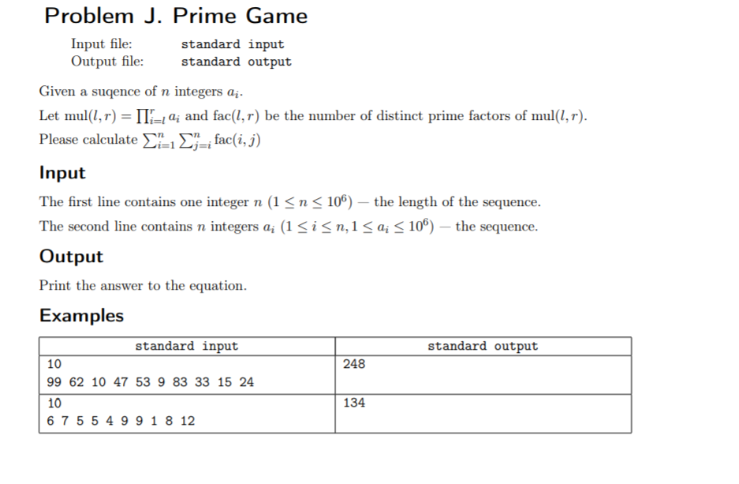

## 关于因子的一些结论与简单证明

$d(N)表示N的因子个数$ 

$d(i\times j)=\sum_{x|i}\sum_{y|j}[gcd(x, y)=1]$ 


设*表示狄利克雷卷积，

$d=I*I$---$d*\mu=I*\mu*I$---$d*\mu=I$

**前置知识** 

n的因子个数是：

$\prod_{i=1}^n(q_i+1)$ 


n的全部因子之和是：

$(1+p_1+p_1^2...+p_1^{q_1})\times(1+p_2+p_2^2...+p_2^{q_2})..\times(1+p_n+p_n^2...+p_n^{q_n})$

$=\prod_{i=1}^n\sum_{j=0}^{p_i}p_i^j$

用分治(一般都会取模)。

举例(首项为1，公比为p，长度5+1)：

$1+p+p^2+p^3+p^4+p^5$

$1+p+p^2+p^3\times(1+p+p^2)$

$(1+p+p^2)\times(1+p^3)$

分治，范围变小

同理：首项p...


# [Happy 2004](http://acm.hdu.edu.cn/showproblem.php?pid=1452)

## 题意：

求$2004^k$的全部因子的和，对$29$取模

## 思路（详细解释在扩展）：

积性函数，等比数列求和

## $Code$：

```cpp
#include<bits/stdc++.h>
using namespace std;
typedef long long ll;
const int N = 1e3+10;
const int inf = 0x7ffffff;
const int mod = 29;
ll qpow(ll x, ll y) {
    ll ans = 1;
    while(y) {
        if(y & 1) ans = ans * x % mod;
        x = x * x % mod;
        y >>= 1;
    }
    return ans;
}
ll cal(ll p, ll cnt) {
    if(cnt == 1) return p+1;
    if(cnt == 0) return 1;
    if(cnt % 2) {
        return cal(p, cnt/2)%mod *(qpow(p, cnt/2+1) + 1ll) % mod;
    }
    else {
        return (cal(p, cnt/2-1)%mod * (qpow(p, cnt/2+1) + 1ll) % mod + qpow(p, cnt/2)) % mod;
    }
}
int main() {
#ifndef ONLINE_JUDGE 
    freopen("in.txt", "r", stdin);
    freopen("out.txt", "w", stdout);
#endif  
    ll n;
    while(cin >> n, n)
    cout << cal(2ll, 2*n)*cal(3ll, n) % mod * cal(22ll, n) % mod << endl;
    return 0;
}
```


## 扩展（因子和，积性函数）

### $n$的全部因子之和是：

$(1+p_1+p_1^2...+p_1^{q_1})\times(1+p_2+p_2^2...+p_2^{q_2})..\times(1+p_n+p_n^2...+p_n^{q_n})$

$=\prod_{i=1}^n\sum_{j=0}^{p_i}p_i^j$

用分治(一般都会取模)。

举例(首项为1，公比为p，长度5+1)：

$$
1+p+p^2+p^3+p^4+p^5\\

1+p+p^2+p^3\times(1+p+p^2)\\

(1+p+p^2)\times(1+p^3)\\
$$
分治，范围变小

同理：首项为$p$或者其他。

上面的式子可以感性理解一下，对$n$进行质因子分解。对质因子$p_i$可以选择$[0,q_i]$次来组成某个因子。


### 积性函数$\sigma$

$\sigma:\sigma_k(n)=\sum_{d|n}d^k$  表示n的所有因数的k次方之和（注意不是和的k次方）。**证明**如下：

需要证明：$\sigma_k(nm)=\sigma_k(n)\times\sigma_k(m)~~~(k>=0)$ 

设集合 $N=\{a_i|1\leq i \leq k\}$ 为 n 的所有因子的集合，集合$M=\{b_j|1\leq j \leq k'\}$的所有因子的集合。

 $\because~\gcd(n,m)=1$ $\therefore gcd(a_i,b_j)=1$ 

$ \therefore$ N与 M的交集为空，即  $\forall i,j~~~a_i\neq b_j $

$\therefore$将集合N中的元素与集合M中的元素 一 一 相乘，就能得到$n\times m$的所有因子。

$\therefore\sigma_k(nm)=\sum_{i=1}^k \sum_{j=1}^{k'} (a_i \times b_j)^k=\sum_{i=1}^k \sum_{j=1}^{k'} a_i^k\times b_j^k$  

$ \because \sigma_k(n)=\sum_{i=1}^k a_i^k~~，~\sigma_k(m)=\sum_{j=1}^{k'}b_j^k$ 

$ \therefore \sigma_k(n)\times \sigma_k(m)=\sum_{i=1}^k a_i^k\times \sum_{j=1}^{k'}b_j^k=\sum_{i=1}^k \sum_{j=1}^{k'}a_i^k \times b_j^k$ 

$\therefore \sigma_k(nm)=\sigma_k(n)\times \sigma_k(m)$ 


根据这个积性函数，上面求$n$的全部因子和是$k$等于$1$的情况。

我们对$n$进行质因子分解，对于一个质因子$p$，设它的次幂为$q$，则它的因子之和就是$(1+p+\cdots+p^{q})$。

对于$n$的互不相同的质因子，两两互质，就能直接将他们乘起来，得到$\sigma_1(n)$的值。


1. 求$d(N)$ , 唯一分解定理，排列组合

$N=\prod_{i-1}p_i^{q_i},d(N)=\prod_{i=1}^n(q_i+1)$ 


2. 求$d(N!)$ ,利用公式得到类唯一分解定理，再排列组合。

$N!=(k^m)\times m！\times a,~k为一个常数，m=\frac{N}{k},a为没有因子为k的数的乘积$。


公式推导：

$N！=(k\times 2 k\times 3 k...\times m k)\times a$

$~~~~~~~=k^m\times m!\times a---因为m中可能还有k的倍数$ 

$~~~~~~~=p_1^{q_1}\times a---取k为质数p_1$

$~~~~~~~=p_1^{q_1}\times p_2^{q_2}\times a'$

...

对于每个质数的指数的求法：

$q_i=\lfloor\frac{N}{p_i}\rfloor+\lfloor\frac{N}{p_i^2}\rfloor+...\lfloor\frac{N}{p_n^n}\rfloor$,当$\lfloor\frac{N}{p_{n+1}^{n+1}}\rfloor=0$，停止

举个例子：

$10！=（2\times 4\times 6\times 8\times 10)\times (1\times 3\times 5\times 7\times 9)$

$10!=2^5\times 5!\times(1\times 3\times 5\times 7\times 9)$

$10!=2^5\times (2\times 4)\times(1\times 3\times 5)\times(1\times 3\times 5\times 7\times 9)$

$10!=2^7\times 2!\times(1\times 3\times 5)\times(1\times 3\times 5\times 7\times 9)$

$10!=2^8\times 1\times(1\times 3\times 5)\times(1\times 3\times 5\times 7\times 9)$

所以2的指数为8.

同理后面的每个数都是其他质数的倍数，都可以按这种方法求得质数的指数。

因为1-N中每个数都是质数或质数的倍数，所以我们可以将每个数都进行拆分。


所以我们得到$N!=\prod_{i=1}p_i^{q_i}$，所以因子个数为$\sum_{i=1}(q_i+1)$ 


3. 给定数列的乘积因子个数

 

其实这个也是基于第一个结论得到的。

给定 a1 a2 a3 …… an;

我们可以找到最大的一个元素Max(a);

把Max以内的素数打表

然后把质因子清零，进行如下循环，就可以找到各个质因子的个数：

for（a=1；a<=n;a++）

for(p=1;p<_;p++ )

  if(__) e(p)++;

这样质因子的质数个数就求出来了，然后就可以根据公式$M=（e1+1）*（e2+1）*……*（en+1）$ 求出因子个数


## 积性函数与线性筛的结合

1. 逆元递推(线性递推)

$设a*x+k=p，得a=\frac{p}{x},k=p\%x$​.

 同时乘$x^{-1}, k^{-1}$分别表示在模p下的逆元，得到$a*k^{-1}+x^{-1}\equiv 0(mod~p)$

所以$x^{-1}=-\frac{p}{x}*(p\%x)^{-1}$ ^========^

```
#include<bits/stdc++.h>
using namespace std;
typedef long long ll;
const ll N = 100007;
ll inv[N] = {0, 1};
int main() {
	for(int i=2; i<=N; i++) {
		inv[i] = -(N/i) * inv[N%i];//递推关系
		inv[i] = (inv[i] % N + N) % N;//确保inv[i] > 0;
	} 
	for(int i=0; i<100; i++) {
		cout << inv[i] << ' ';
	} 
	return 0;
} 
```


2.


## 一些求和符号交换证明

1. 

$$
\sum_{j=1}^{m}\sum_{y|j}1=\sum_{y=1}^m\lfloor\frac m y\rfloor\\
证明：\sum_{j=1}^m\sum_{y|j}1=\sum_{y=1}^m\sum_{j=1}^m\sum_{y|j}1=\sum_{y=1}^m\sum_{j=1}^m[gcd(y,j)=y]......(1)\\
=\sum_{y=1}^m\lfloor\frac m y\rfloor......(2)
$$

(1).$y$的取值范围也是$[1,m]$，枚举$y$，如果满足$gcd(y,j)=y$的话，说明$y$是$j$的因子，反过来$j$就是$y$的倍数，转化成：枚举$y$，在$[1,m]$中有多少$y$的倍数。

(2).整除分块


2. 整除分块
   
   $\sum_{i=1}^n\lfloor \frac ni\rfloor$
   
   ```cpp
   ll solve(int n) {
   	ll ans = 0;
       for(int i=1, last; i<=n; i=last+1) {
   		last = n/(n/i);
           ans += 1ll*(n/i)*(last-i+1);
       }
       return ans;
   }
   ```
   
   $\sum_{i=1}^{min(n,m)}f(n)\lfloor \frac ni\rfloor\lfloor \frac mi\rfloor$sum[i]是f(n)的前缀和
   
   ```cpp
   ll solve(ll n, ll m) {
   	ll ans = 0;
       if(n > m) swap(n, m);
       for(int i=1, last; i<=n; i=last+1) {
   		last = min(n/(n/i), m/(m/i));
           ans += 1ll*(n/i)*(m/i)*(sum[last]-sum[i-1]);
       }
       return ans;
   }
   ```
   
   $\sum_{i=1}^n\lceil \frac ni\rceil$，思路：ans=n，再做一次整除分块求$\sum_{i=1}^n\lfloor \frac ni\rfloor$，再减去n的因子个数。
   
   ```cpp
   ll solve(ll n) {
       ll ans = n, res = 1;//ans = n;
       for(int i=1, last; i<=n; i=last+1) {
           last = n/(n/i);
           ans += (n/i)*(last-i+1);
       }
       for(ll i=2; i*i<=n; i++) {
           if(n % i == 0){
               int t = 0;
               while(n % i == 0) t++, n/=i;
               res = res*(t+1);
           }
       }
       if(n > 1) res *= 2;
       return ans-res;
   }
   ```
   
   
   
   


3. $$
   \sum_{d|n}\mu(d)\sum_{k|\frac n d}f(k)=\sum_{k|n}\sum_{d|\frac n k}\mu(d)f(k)\\
   ~\\
   \sum_{d|n}\sum_{k|\frac n d} = \sum_{k|n}\sum_{d|\frac n k}~~(k，d的意义都没改变)\\
   k是\frac n d的因子，所以k是n的因子\\
   \sum_{k|n}\sum_{d|n}\sum_{k|\frac n d}=\sum_{k|n}\sum_{d|\frac n k}\\
   kd是n的因子，所以d是\frac n k的因子\\
   \sum_{k|n}\sum_{d|n}\sum_{d|\frac n k}=\sum_{k|n}\sum_{d|\frac n k}\\
   只取较小条件的\sum_{d|\frac n k}并不会影响d的取值，所以
   \sum_{k|n}\sum_{d|\frac n k}=\sum_{k|n}\sum_{d|\frac n k}\\
   $$
   
4. $$
   \sum_{d|n}\mu(\frac n d)\sum_{k|d}f(k)=\sum_{k|n}\sum_{d|\frac n k}\mu(d)f(k)\\
   令d'=\frac n d,则d=\frac{n}{d'}\\
   \sum_{d'|n}\sum_{\frac{n}{d'}|n}\sum_{k|\frac{n}{d'}}\mu(d')f(k)=\sum_{k|n}\sum_{d'|n}\sum_{d'|\frac{n}{k}}\mu(d')f(k)=\sum_{k|n}\sum_{d'|\frac{n}{k}}\mu(d')f(k)
   $$


## 反素数

### 定义

1.  对于正整数x，其约数的个数记作$g(x)$。例如 $g(1)=1$、$g(6)=4$。

2. 如果某个正整数$x$满足：对任意正整数$i(0<i<x)$,有$g(x)>g(i)$，那么 称$x$为反素数。

感性理解，素数是只有1和本身两个约数，而反素数就是约数个数最多的数（并且在约数相同的情况下更小的那个数），所以反素数是对于一个范围而言的。

### 两个性质

根据唯一分解定理：$x = p_1^{k_1}p_2^{k_2}p_3^{k_3}...p_n^{k_n}$，x的因子个数是$(k_1+1)(k_2+1)...(k_n+1)$。 假如$x$是一个反素数，则：

1. 质因子$p_1,p_2,p_3..p_n$是从2开始的连续的素数。
2. 质因子的指数递减，$k_1\geq k_2\geq...\geq k_n$。

简单证明：

1. 假设x是反素数，且质因子$p_1,p_2,p_3..p_n$不是从2开始的连续的素数。我们就可以把其中的某个素数换成更小的素数，但其指数不发生改变，这样我们就可以保证相同因子个数的情况下，存在一个更小的数，所以x不是反素数。直到交换到从2开始的连续的素数的时候才是最小的。


2. 如果数值小的素数的幂次小于数值大的素数的幂，那么如果把这两个素数的指数交换，那么所得的 因子数量不变，但是得到的值变小，交换到最小的那个数时，质因子的指数一定是递减的。

例题：

[198. 反素数](https://www.acwing.com/problem/content/description/200/)

题意：给出一个n，求不超过n的最大反素数是多少。

思路：根据性质，直接暴力深搜。

```cpp
#include<bits/stdc++.h>
using namespace std;
typedef long long ll;
const int N = 2e5+10;
const ll mod = 1e9+7;
int prime[] = {0, 2, 3, 5, 7, 11, 13, 17, 19, 23, 29, 31};
ll ans = 2e9+10, sum = 0, n;
void dfs(ll u, ll v, ll now, ll cnt) {
    //更新ans，sum，得到答案。
    if(cnt > sum) ans = now, sum = cnt;
    if(cnt == sum) ans = min(ans, now); 
    //循环枚举每个质数的次方。
    for(int i=1; i<=v; i++) {
        if(now*prime[u] > n) break;
        now *= prime[u];
        dfs(u+1, i, now, cnt*(i+1));
    }
}
int main() {
#ifndef ONLINE_JUDGE
    freopen("in.txt", "r", stdin);
    freopen("out.txt", "w", stdout);
#endif
    ll k = 0;
    scanf("%lld", &n);
    while((1ll<<k) <= n) k++;//找到2的最大次方，记得时1ll。
    dfs(1, k, 1ll, 1ll);
    printf("%lld", ans);
    return 0;
}
```


## 奇偶剪枝 

起点坐标$(x,y)$，终点坐标$(ex, ey)$，要恰好在t时刻到达终点，则必须满足$t-abs(x-ex)-abs(y-ey) % 2 == 0$。

```cpp
#include<bits/stdc++.h>
using namespace std;
char a[10][10];
int vis[10][10], n, m;
int f[][2] = {1, 0, 0, 1, -1, 0, 0, -1};//小技巧。
bool dfs(int x, int y, int ex, int ey, int T, int cnt) {
    if(cnt > T) return false;
    if(T == cnt && x == ex && y == ey) return true;
    for(int i=0; i<4; i++) {
        int u = x+f[i][0], v = y+f[i][1];
        if(u>0&&v>0&&u<=n&&v<=m&&!vis[u][v]&&a[u][v]!='X') {
            vis[u][v] = 1;
            if(dfs(u, v, ex, ey, T, cnt+1)) return true; 
            vis[u][v] = 0;
        }
    }
    return false;
}
int main() {
#ifndef ONLINE_JUDGE
    freopen("in.txt", "r", stdin);
    freopen("out.txt", "w", stdout);
#endif
    int t, x, y, ex, ey;
    while(cin >> n >> m >> t) {
        memset(vis, 0, sizeof vis);
        if(n==0 && m == 0 && t == 0) break;
        for(int i=1; i<=n; i++) {
            for(int j=1; j<=m; j++) {
                cin >> a[i][j];
                if(a[i][j] == 'S') x = i, y = j;
                if(a[i][j] == 'D') ex = i, ey = j;
            }
        }  
        if(t-abs(x-ex)-abs(y-ey)&1) {
            cout << "NO\n";
            continue;
        } 
        vis[x][y] = 1;
        if(dfs(x, y, ex, ey, t, 0)) printf("YES\n");
        else printf("NO\n");
    }
    return 0;
}
```


## [Lawrence of Arabia(HDU)](http://acm.hdu.edu.cn/showproblem.php?pid=3102)

区间$dp$+四边形不等式

[题解](https://blog.csdn.net/weixin_30265171/article/details/96073768)

[四边形不等式](https://blog.csdn.net/noiau/article/details/72514812)

AC

```cpp
#include<bits/stdc++.h>
using namespace std;
typedef long long ll;
const int N = 1e3+10;
const ll mod = 1e9+7;
int a[N], sum[N], f[N][N], dp[N][N];
int main() {
#ifndef ONLINE_JUDGE
    freopen("in.txt", "r", stdin);
    freopen("out.txt", "w", stdout);
#endif
    int n, m;
    while(scanf("%d%d", &n, &m), n) {
        memset(dp, 0x3f, sizeof dp);
        for(int i=1; i<=n; i++) {
            scanf("%d", &a[i]);
            sum[i] = sum[i-1] + a[i];
        }
        for(int i=1; i<=n; i++) {
            for(int j=i+1; j<=n; j++) {
                f[i][j] = f[i][j-1]+(sum[j-1]-sum[i-1])*a[j];
            }
        }
        for(int i=1; i<=n; i++) dp[i][0] = f[1][i];
        for(int i=1; i<=n; i++) {
            for(int j=1; j<=m; j++) {
                for(int k=1; k<=i; k++) {
                    dp[i][j] = min(dp[i][j], dp[k][j-1]+f[k+1][i]);
                }
            }
        }
        printf("%d\n", dp[n][m]);
    }
    return 0;
}

```

TLE

```cpp
#include<bits/stdc++.h>
using namespace std;
typedef long long ll;
const int N = 1e3+10;
const ll mod = 1e9+7;
int a[N], sum[N], sum2[N], dp[N][N];
int main() {
#ifndef ONLINE_JUDGE
    freopen("in.txt", "r", stdin);
    freopen("out.txt", "w", stdout);
#endif
    int n, m;
    while(scanf("%d%d", &n, &m), n) {
        memset(dp, 0x3f, sizeof dp);
        for(int i=1; i<=n; i++) {
            scanf("%d", &a[i]);
            sum[i] = sum[i-1] + a[i];
            sum2[i] = sum2[i-1] + a[i]*a[i];
            dp[i][0] = (sum[i]*sum[i] - sum2[i]) >> 2;
        }
        for(int i=1; i<=n; i++) {
            for(int j=1; j<=m; j++) {
                for(int k=1; k<=i; k++) {
                    dp[i][j] = min(dp[i][j], dp[k][j-1]+((sum[i]-sum[k])*(sum[i]-sum[k])-(sum2[i]-sum2[k]))/2);
                }
            }
        }
        printf("%d\n", dp[n][m]);
    }
    return 0;
}

```


## [P1130 红牌(dp入门题)](https://www.luogu.com.cn/problem/P1130)

```cpp
#include<bits/stdc++.h>
using namespace std;
const int N = 2e3+10;
const double eps = 1e-5;
const int inf = 0x7ffffff;
int s[N][N], dp[N][N];
int main() {
#ifndef ONLINE_JUDGE 
    freopen("in.txt", "r", stdin);
    freopen("out.txt", "w", stdout);
#endif
    int n, m;
    cin >> n >> m;
    for(int i=1; i<=m; i++)
        for(int j=1; j<=n; j++)
            cin >> s[j][i];
    for(int i=1; i<=n; i++) 
        for(int j=1; j<=m; j++) 
            dp[i][j] = min(dp[i-1][j], j==1?dp[i-1][m]:dp[i-1][j-1]) + s[i][j];
    int ans = inf;
    for(int i=1; i<=m; i++) ans = min(ans, dp[n][i]);
    cout << ans << endl;
    return 0;
}
```


## [1,n]区间中的约数个数的和（思维)

求前n个数的约数个数和。

思路：求每个数的贡献。n/i表示i这个因子在约数中出现的次数。

技巧：整除分块。
$$
ans:\sum_{i=1}^n\lfloor\frac ni\rfloor
$$


```cpp
#include<bits/stdc++.h>
using namespace std;
typedef unsigned long long ll;
int main() {
    ll n, sum = 0;
    cin >> n;
    for(int i=1,last; i<=n; i=last+1) {
        last = n/(n/i);
        sum += n/i*(last-i+1);
    }
    cout << sum;
    return 0;
}
```


## [*欧拉](https://ac.nowcoder.com/acm/problem/18949)


[题解](https://blog.csdn.net/jokingcoder/article/details/82818046?utm_medium=distribute.pc_relevant.none-task-blog-BlogCommendFromBaidu-1.control&dist_request_id=1b6440ee-0acb-4776-8adb-e7afc560b9e0&depth_1-utm_source=distribute.pc_relevant.none-task-blog-BlogCommendFromBaidu-1.control)

积性函数筛法

$$
f(n) = \sum_{d|n}d^k\mu(\frac nd)\\
前提：p，n互质(gcd(p,n)=1)\\
f(pn)=\sum_{pd|pn}(pd)^k\mu(\frac {pn}{pd})+\sum_{d|n}d^k\mu(\frac {pn}d)\\
f(pn)=p^kf(n)-f(n)\\
前提：p，n不互质\\
f(pn) = p^kf(n)
$$
$\sum_{pd|pn}(pd)^k\mu(\frac {pn}{pd})$枚举pd，d是n的因子，pd就是pn因子的一部分。

$\sum_{d|n}d^k\mu(\frac {pn}d)$枚举n的因子d，表示剩下的pn的全部因子。

$\sum_{d|n}d^k\mu(\frac {pn}d)=-f(n)$，根据莫比乌斯函数的性质，得到结论；

$\because \mu(\frac nd)=1,0,-1，\mu(x)=(-1)^k(x=p_1p_2...p_k)$

$\therefore\mu(\frac {pn}d)=-1,0,1$


根据狄利克雷卷积的性质：$f$是积性函数，$g$是积性函数，则$f*g$是积性函数。

$f(n) = \sum_{d|n}d^k\mu(\frac nd)$。$d^k$是积性函数，$\mu(\frac nd)$是积性函数$\therefore f(n)$是积性函数。


$$
n=\prod_{i=1}^rp_i^{k_i}=p_1^{k_1}p_2^{k_2}...p_r^{k_r}\\
 \mu(p^t)=0(t>1)\\
 f(n)=\prod_{i=1}^{r}(p_i^{k_i-1})^kf(\prod_{i=1}^rp_i)=(p_1^{k_1-1}p_2^{k2-1}...p_r^{kr-1})^kf(p_1p_2...p_n)\\
 f(p_1p_2...p_r)=(p_1^k-1)(p_2^k-1)...(p_r^k-1)\\
 f(n)=...
$$


```cpp
#include<bits/stdc++.h>
using namespace std;
typedef long long ll;
const int mod = 998244353;
const int N = 5e6+10;
int p[N], mu[N], tot;
ll ans[N];
bool st[N];
ll qpow(ll x, ll y) {
    ll ans = 1;
    while(y) {
        if(y & 1) ans = ans * x % mod;
        x = x * x % mod;
        y >>= 1;
    }
    return ans % mod;
}
/*

*/
void init(ll k) {
    mu[1] = 1, ans[1] = 1;
    for(int i=2; i<N; i++) {
		if(!st[i]) p[tot++] = i, ans[i] = (qpow(i, k)-1+mod) % mod;
		for(int j=0; j<tot&&i*p[j]<N; j++) {
			st[i*p[j]] = 1;
			if(i % p[j] == 0) {
				ans[i*p[j]] = ans[i] * qpow(p[j], k) % mod;
				break;
			}
			ans[i*p[j]] = (ans[i] * ((qpow(p[j], k)-1+mod)%mod)) % mod;
		}
	}
}
int main() {
    ll m, k;
    cin >> m >> k;
    init(k);
    while(m--) {
        ll n;
        cin >> n;
        cout << ans[n] << endl;
    }
    return 0;
}
```


## 平方和立方和公式

$$
\sum_{i=1}^ni^2=\frac {n(n+1)(2n+1)}6\\
\sum_{i=1}^ni^3=\frac {n^2(n+1)^2}4\\
$$


# 分数规划


## 问题：

求解类似与
$$
\sum_{i=1}^n\frac {a[i]\times w[i]}{b[i]\times w[i]}\\
w[i] \in\{0,1\}\\
$$


## 题目：


### [Dropping tests](http://poj.org/problem?id=2976)


```cpp
// #include<bits/stdc++.h>
#include<iostream>
#include<cstdio>
#include<queue>
using namespace std;
int a[1010], b[1010];
bool check(double x, int n, int k) {
    priority_queue<double> q;
    double tmp;
    for(int i=1; i<=n; i++) {
        tmp = 100.0*a[i]-x*b[i];
        q.push(tmp);
    }
    double ans = 0;
    while(k--) {
        ans += q.top();
        q.pop();
    }
    return ans >= 0;
}
int main() {
    int n, m;
    while(cin >>n >> m && (n || m)) {
        for(int i=1; i<=n; i++) {
            cin >> a[i];
        }
        for(int i=1; i<=n; i++) {
            cin >> b[i];
        }
        double l = 0, r = 100, mid;
        while(0.0001 < r-l) {
            mid = (l + r) / 2;
            if(check(mid, n, n-m)) l = mid;
            else r = mid-0.01;
        }
        cout << (int)(l+0.5) << endl;
    }
    return 0;
}
```


### [USACO18OPEN\]Talent Show G ](https://www.luogu.com.cn/problem/P4377)(分数规划+01背包)


```cpp
#include<bits/stdc++.h>
using namespace std;
int w[300], t[300];
double f[250010];
bool check(double x, int n, int m) {
    //check函数选与不选当前位置使其成为最大值。
    //01背包
    for(int i=1; i<=m; i++) f[i] = -1e9;
    for(int i=1; i<=n; i++) {
        for(int j=m; j>=0; j--) {
            int k = min(m, j+w[i]);
            f[k] = max(f[k], f[j]+1.0*t[i]-x*w[i]);
        }
    } 
    return f[m] >= 0;
}
int main() {
    int n, m, sum = 0;
    cin >> n >> m;
    for(int i=1;i <=n; i++) {
        cin >> w[i] >> t[i];
        sum += t[i];
    }
    double l = 0, r = sum, mid;
    while(0.00001 < r-l) {
        mid = (l + r)/2;
        // cout << mid << endl;
        if(check(mid, n, m)) l = mid;
        else r = mid-0.00001;
    }
    cout << (int)(1000*l) << endl;
}
```


### [*Desert King](http://poj.org/problem?id=2728)（分数规划+最小生成树）

[题解](https://blog.csdn.net/yew1eb/article/details/39673031) 牛顿迭代+prim

克鲁斯卡尔+迭代搜索

```cpp
#include <iostream>
#include <string.h>
#include <math.h>
#include <queue>
#include <algorithm>
#include <stdlib.h>
#include <map>
#include <set>
#include <stdio.h>
using namespace std;
#define LL __int64
#define pi acos(-1.0)
//#pragma comment(linker, "/STACK:1024000000")
const int mod=1e9+7;
const int INF=0x3f3f3f3f;
const double eqs=1e-3;
const int MAXN=40000+10;
int bin[2000], n;
double p, q;
int find1(int x)
{
        return bin[x]==x?x:bin[x]=find1(bin[x]);
}
struct N
{
        int x, y, z;
}dian[2000];
struct node
{
        double w, dist, z;
        int u, v;
}edge[1000010];
int cnt;
void add(int u, int v, double dist, double z)
{
        edge[cnt].u=u;
        edge[cnt].v=v;
        edge[cnt].dist=dist;
        edge[cnt++].z=z;
}
double getdist(N f1, N f2)
{
        return sqrt((f1.x-f2.x)*1.0*(f1.x-f2.x)+(f1.y-f2.y)*1.0*(f1.y-f2.y));
}
bool cmp(node f1, node f2)
{
        return f1.w<f2.w;
}
void krus(double L)
{
        double ans=0;
        int i, f1, f2;
        for(i=0;i<cnt;i++){
                edge[i].w=edge[i].z-L*edge[i].dist;
        }
        sort(edge,edge+cnt,cmp);
        for(i=0;i<n;i++){
                bin[i]=i;
        }
        int k=0;
        p=q=0;
        for(i=0;i<cnt;i++){
                f1=find1(bin[edge[i].u]);
                f2=find1(bin[edge[i].v]);
                if(f1!=f2){
                        bin[f2]=f1;
                        k++;
                        p+=edge[i].z;
                        q+=edge[i].dist;
                }
                if(k==n-1) return ;
        }
}
int main()
{
        int i, u, v, z, j;
        while(scanf("%d",&n)!=EOF&&n){
                for(i=0;i<n;i++){
                        scanf("%d%d%d",&dian[i].x,&dian[i].y,&dian[i].z);
                }
                cnt=0;
                for(i=0;i<n;i++){
                        for(j=0;j<i;j++){
                                add(i,j,getdist(dian[i],dian[j]),abs(dian[i].z-dian[j].z)*1.0);
                        }
                }
                double ans=0.5, tmp;
                while(1){
                        tmp=ans;
                        krus(tmp);
                        ans=p/q;
                        if(fabs(tmp-ans)<=eqs) break;
                }
                printf("%.3f\n",ans);
        }
        return 0;
}

```


# 费马小定理

## 问题：


$$
对\forall(a,p)=1，p是质数\\
\exists~a^{p-1}\equiv1(mod~p)\\
$$


## 证明

先来第一个引理：
$$
如果(c,m)=1, ac\equiv bc(mod~m)\\
则a\equiv b(mod~m)\\
$$
证明：
$$
\because ac\equiv bc(mod~m)\\
\therefore ac-bc\equiv0(mod~m)\\
\therefore(a-b)c\equiv0(mod~m)\\
\because (c,m)=1\\
\therefore c在模m下存在逆元c^{-1}\\
\therefore (a-b)cc^{-1}=0(mod~m)\\
\therefore a-b\equiv0(mod~m)\\
\therefore a\equiv b(mod~m)\\
$$
再来第二个引理：
$$
给定一个数m，和对应的一个完全剩余系\{a_1,a_2,a_3...,a_{m-1}\}\\
\forall(c,m)=1,\{a_1c,a_2c,a_3c,a_{p-1}c\}在模m下也是一个完全剩余系\\
$$
证明：
$$
假设在\{a_1c,a_2c,a_3c,a_{p-1}c\}中,\exists a_ic\equiv a_jc(mod~m)(i\neq j)\\
则根据引理1，可知a_i\equiv a_j(mod~m)\\
与条件中的a_i,a_j是属于一个完全剩余系下矛盾，所以假设不成立\\
得证：\{a_1c,a_2c,a_3c,a_{p-1}c\}的每一个值在模m下都不相等\\
根据抽屉原理可知\{a_1c,a_2c,a_3c,a_{p-1}c\}也是一个完全剩余系。
$$


接下来就是证明费马小定理了：
$$
对于一个素数p，我们先构造一个模p的完全剩余系\{0, 1,2,3,...,p-1\}。\\
对于\forall a,满足(a,p)=1，则\{0, a,2a,3a,...,(p-1)a\}也是一个完全剩余系\\
\therefore 1\times2\times3...\times(p-1)\equiv a\times2a\times3a...\times(p-1)a(mod~p)\\
(p-1)!\equiv a^{p-1}(p-1)!(mod~p)\\
\because ((p-1)!,p)=1， 引理1\\
\therefore a^{p-1}=1(mod~p)\\
$$


在长度为n某个区间生成随机数，存在两个相同的数，需要的次数的的期望大约是$\sqrt n$（生日悖论）。


?


# O(1)快速乘


```cpp
inline ll multi(ll x, ll y, ll mod) {
    ll tmp=(x*y-(ll)((long double)x/mod*y+1.0e-8)*mod);
    return tmp<0 ? tmp+mod : tmp;
}
```


#  python进制转化


```py
def C(a, b, c):
    s = ''
    k, I = 0, 1
    for i in reversed(c):
        if '0' <= i <= '9':
            k += (ord(i) - ord('0')) * I
        elif 'A' <= i <= 'Z':
            k += (ord(i) - ord('A') + 10) * I
        else:
            k += (ord(i) - ord('a') + 36) * I
        I = I * a
    if k == 0:
        return '0'
    while k:
        m = k % b
        if 0 <= m <= 9:
            s = s + str(chr(ord('0') + m))
        if 10 <= m <= 35:
            s = s + str(chr(ord('A') + m-10))
        if 36 <= m <= 61:
            s = s + str(chr(ord('a') + m-36))
        k //= b
        # reversed(s)
    return s


x = input()
y = []
tmp = ''
for i in x:
    if i == ' ':
        y.append(tmp)
        tmp = ''
    else:
        tmp += i
y.append(tmp)
a = eval(y[0])
b = eval(y[1])
cc = C(a, b, y[2])
ans = ''
for i in reversed(cc):
    ans += i
    print(i, end='')
# print()
# for i in reversed(C(b, a, ans)):
#     print(i, end='')
```


# 并查集

## [P1197 [JSOI2008]星球大战](https://www.luogu.com.cn/problem/P1197)

思维：拆点=反向建点。

```cpp
#include<bits/stdc++.h>
using namespace std;
#define double long double
#define pdd pair<double, double>
#define pii pair<int, int>
const int N = 4e5+10;
const double pi = acos(-1);
typedef long long ll;
int f[N], vis[N], fa[N], A[N], faa[N];
int finds(int x) {
    if(fa[x] == x) return x;
    else return fa[x] = finds(fa[x]);
}
int F(int x) {
    if(faa[x] == x) return x;
    else return faa[x] = F(faa[x]);
}
vector<int> v[N];
int main() {
#ifndef ONLINE_JUDGE
    freopen("in.txt", "r", stdin);
    freopen("out.txt", "w", stdout);
#endif
    int n, m, x, y, tmp;
    scanf("%d%d", &n, &m);
    tmp = n;
    for(int i=1; i<=n; i++) fa[i] = i, faa[i] = i;
    for(int i=1; i<=m; i++) {
        scanf("%d%d", &x, &y);
        int u = F(x), h = F(y);
        if(u != h) {
            tmp--;
            faa[u] = h;
        }
        v[x].push_back(y);
        v[y].push_back(x);
    }
    int k;
    cin >> k;
    for(int i=1; i<=k; i++) {
        scanf("%d", &f[i]);
        vis[f[i]] = 1;
    }
    int ans = n-k;
    for(int i=0; i<n; i++) {
        if(!vis[i]) {
            for(int j=0; j<v[i].size(); j++) {
                if(!vis[v[i][j]]) {
                    int a = finds(i), b = finds(v[i][j]);
                    if(a != b) {
                        ans--;
                        fa[a] = b;
                    }
                }
            }
        }
    }
    printf("%d\n", tmp);
    A[k] = ans;
    for(int i=k; i>=1; i--) {
        ans++;
        vis[f[i]] = 0;
        for(int j=0; j<v[f[i]].size(); j++) {
            if(!vis[v[f[i]][j]]) {
                int a = finds(f[i]), b = finds(v[f[i]][j]);
                    if(a != b) {
                        ans--;
                        fa[a] = b;
                    }
            }
        }
        A[i-1] = ans;
    }
    for(int i=1; i<=k; i++) printf("%d\n", A[i]); 
    return 0;
}
```


# RMQ(ST表)


```cpp
int a[N];
int f1[N][21];
int f2[N][21];
int logn[N];
ll ans;
 
void init() {
    logn[1] = 0;
    for (int i = 2; i <= n; ++i) {
        logn[i] = logn[i / 2] + 1;
    }
    for (int i = 1; i <= n; ++i) {
        f1[i][0] = a[i];
        f2[i][0] = a[i];
    }
    for (int j = 1; j < 21; ++j) {
        for (int i = 1; i + (1 << j) - 1 <= n && i <= n; ++i) {
            f1[i][j] = max(f1[i][j - 1], f1[i + (1 << (j - 1))][j - 1]);
            f2[i][j] = min(f2[i][j - 1], f2[i + (1 << (j - 1))][j - 1]);
        }
    }
}
 
int maxn(int l, int r) {
    int s = logn[r - l + 1];
    return max(f1[l][s], f1[r - (1 << s) + 1][s]);
}
 
int minn(int l, int r) {
    int s = logn[r - l + 1];
    return min(f2[l][s], f2[r - (1 << s) + 1][s]);
}
```


# 树状数组求最大值最小值

```cpp
#include <bits/stdc++.h>

using namespace std;
const int N = 5e4+10;
typedef long long ll;
const int mod = 1e9+7;
// #define int long long

int mx[N], mi[N], a[N], n, m;
#define lowbit(x) (x&(-x))
void add(int x, int y) {
    while(x <= n) {
        mx[x] = max(mx[x], y);
        mi[x] = min(mi[x], y);
        x += lowbit(x);
    }
}


int minn(int x, int y) {
    if(y > x) {
        if(y - lowbit(y) > x) return min(minn(x, y-lowbit(y)), mi[y]);
        else return min(a[y], minn(x, y-1));
    }
    else return a[y];
}
int maxn(int x, int y) {
    if(y > x) {
        if(y - lowbit(y) > x) return max(maxn(x, y-lowbit(y)), mx[y]);
        else return max(a[y], maxn(x, y-1));
    }
    else return a[y];   
}
int main() {
#ifndef ONLINE_JUDGE
    freopen("in.txt", "r", stdin);
    freopen("out.txt", "w", stdout);
#endif
    memset(mi, 0x3f, sizeof mi);
    int x, y;
    cin >> n >> m;
    for(int i=1 ;i<=n; i++) {
        cin >> a[i];
        add(i, a[i]);
    }
    for(int i=1; i<=m; i++) {
        cin >> x >> y;
        cout << maxn(x, y) - minn(x, y) << endl;
    }
}
```


# 大整数除法


```cpp
#include<bits/stdc++.h>
using namespace std;
const int mod = 10;
int s[1000000], tot = 6;
void mult(int x) {
    int t = 0;
    for(int i=0; i<=tot; i++) {
        s[i] = s[i] * x + t;
        t = s[i] / mod;
        s[i] %= mod;
    }
    if(t > 0) {
        s[++tot] = t;
        while(s[tot] >= mod) s[tot+1] = s[tot]/mod, s[tot]%=mod, tot++;
    }
}

void cf(int x) {
    int t = 0, u, v = 1;
    for(int i=tot; i>=0; i--) {
        u = s[i];
        s[i] = (s[i] + t*mod) / x;
        t = (u + t*mod) % x;                   
        if(s[i] == 0 && v) tot--;
        else v = 0;
    }
}
void put() {
    for(int i=tot; i>=0; i--) cout << s[i];
    cout << endl;
}
void ch(int x) {
    tot = -1;
    while(x) {
        s[++tot] = x % mod;
        x /= 10;
    }
}
int as() {
    int ans = 0;
    for(int i=tot; i>=0; i--) {
        ans = ans*mod + s[i];
    }
    return ans;
}
int main() {
    int ans = 0;
    for(int i=1; i<=100; i++) {
        int a = rand(), b = rand(), c;
        if(a < b) swap(a, b);
        cout <<a << ' ' << b << endl;
        ch(a);
        cf(b);
        c = as();
        if(c == a/b) ans++;
    }
    cout << ans;
    // int n;   
    // while(cin >> n) {
    //     memset(s, 0, sizeof s);
    //     s[0] = 1, tot = 0;
    //     for(int i=1; i<=n; i++) {
    //         mult(i);
            
    //     }put();
    // }
    return 0;
}
```


# 矩阵乘法的加速

可以重新排列循环以提高空间局部性，这样的优化不会改变矩阵乘法的时间复杂度，但是会在得到常数级别的提升。

```cpp
// 以下文的参考代码为例
inline mat operator*(const mat& T) const {
  mat res;
  for (int i = 0; i < sz; ++i)
    for (int j = 0; j < sz; ++j)
      for (int k = 0; k < sz; ++k) {
        res.a[i][j] += mul(a[i][k], T.a[k][j]);
        res.a[i][j] %= MOD;
      }
  return res;
}
// 不如
inline mat operator*(const mat& T) const {
  mat res;
  int r;
  for (int i = 0; i < sz; ++i)
    for (int k = 0; k < sz; ++k) {
      r = a[i][k];
      for (int j = 0; j < sz; ++j)
        res.a[i][j] += T.a[k][j] * r, res.a[i][j] %= MOD;
    }
  return res;
}
```


# 取模

性质：$\because a~mod~c\neq b~mod~c\therefore|a-b|~mod~c\neq0,满足条件的c一定不是|a-b|的因子$


# __int128

``` cpp
inline __int128 read() {
	__int128 x = 0, f = 1;
	char ch = getchar();
	while(ch < '0' || ch > '9') {
		 if(ch == '-') f = -1;
		 ch = getchar();
	}
	while(ch >= '0' && ch <= '9') {
		x = x * 10 + ch - '0';
		ch = getchar();
	}
	return x * f;
}
inline void write(__int128 x) {
	if(x < 0) {putchar('-'), x = -x;}
	if(x > 9) write(x/10);
	putchar(x % 10 + '0');
}
```


# [Math(高中数学)](https://ac.nowcoder.com/acm/contest/11254/E)


$$
\sum_{i=1}^n\sum_{j=1}^i[ij+1|i^2+j^2]\\
[ij+1|i^2+j^2]\equiv k(ij+1)=i^2+j^2\\
设i是变量\\
根据韦达定理则可以得到~i_1+i_2=kj\\
$$


# [Best Cow Fences(求序列区间最大平均值)](http://poj.org/problem?id=2018)

推式子+二分

```cpp
// #include<bits/stdc++.h>
#include<cstdio>
#include<iostream>
// #include<algoriphi>
using namespace std;
typedef long long ll;
const int N = 1e5+10;
const int mod = 998244353;
const ll inf = 1e9;
const double eps = 1e-5;
// typedef __int128 ll;
ll read() {
    ll x = 0; ll f = 1; char s = getchar();
    while(s < '0' || s > '9') {if(s == '-') f = -1; s = getchar();}
    while(s >= '0' && s <= '9') {x = (x << 3) + (x << 1) + s - 48; s = getchar();}
    return x * f;
}
inline ll multi(ll x, ll y, ll mod) {
    ll tmp=(x*y-(ll)((long double)x/mod*y+1.0e-8)*mod);
    return tmp<0 ? tmp+mod : tmp;
}
ll s[N], sum[N], n, m;
bool check(int x) {
	for(int i=1; i<=n; i++) {
		int tmp = s[i] - x;
		sum[i] = sum[i-1] + tmp;
	}
	ll mi = inf;
	for(int i=m; i<=n; i++) {
		mi = min(sum[i-m], mi);
		if(sum[i] - mi >= 0) return true;
	}
	return false;
}
int main() {
// #ifndef ONLINE_JUDGE
//     freopen("in.txt", "r", stdin);
//     freopen("out.txt", "w", stdout);
//     int StartTime = clock();
// #endif
	
	scanf("%d%d", &n, &m);
	ll l = inf, r = 0;
	for(int i=1; i<=n; i++) {
		scanf("%lld", &s[i]);
		s[i] *= 1000;
		l = min(s[i], l), r = max(r, s[i]);
	}
	while(l < r) {
		double mid = (l + r + 1) / 2;
		if(check(mid)) l = mid;
		else r = mid-1;
	}
	printf("%lld", l);

// #ifndef ONLINE_JUDGE
//     printf("Run_Time = %d ms\n", clock() - StartTime);
// #endif
    return 0;
}
```


# 悬线法

求最大子矩阵的面积（或者单调队列


## 题目

### [ 最大正方形](https://www.luogu.com.cn/problem/P1387)

```cpp
#include <bits/stdc++.h>

using namespace std;
typedef long long ll;
const int N = 1e3+10;
int s[N][N], H[N][N], L[N][N], R[N][N];
int main() {
#ifndef ONLINE_JUDGE
    freopen("in.txt", "r", stdin);
    freopen("out.txt", "w", stdout);
    int StartTime = clock();
#endif
    int n, m;
    char c;
    scanf("%d%d", &n, &m);
    for(int i=1; i<=n; i++) {
        for(int j=1; j<=m; j++) {
            cin >> c;
            // cout << c << ' ';
            if(c == '1') {
                s[i][j] = 1;
                H[i][j] = H[i-1][j]+1;
            }
            else s[i][j] = 0;
            L[i][j] = R[i][j] = j;
        }
        // cout << endl;
    }
    for(int i=1; i<=n; i++) {
        H[i][0] = H[i][m+1] = -1;
    }
    ll ans = 0;
    for(int i=1; i<=n; i++) {
        for(int j=1; j<=m; j++) {
            while(H[i][j] <= H[i][L[i][j]-1]) L[i][j] = L[i][L[i][j]-1];
        }
        for(int j=m; j>=1; j--) {
            while(H[i][j] <= H[i][R[i][j]+1]) R[i][j] = R[i][R[i][j]+1];
        }
        for(int j=1; j<=n; j++) {
            ans = max(ans, 1ll*min(R[i][j]-L[i][j]+1, H[i][j]));
        }
    }
    printf("%lld", ans);
#ifndef ONLINE_JUDGE
    printf("Run_Time = %d ms\n", clock() - StartTime);
#endif
    return 0;
}
```


### [奶牛浴场](https://www.luogu.com.cn/problem/P1578)

从左往右，从右往左，从上往下。

```cpp
#include <bits/stdc++.h>

using namespace std;
const int N = 5e3+10;
typedef long long ll;
const int mod = 1e9+7;
// #define int long long
#define lowbit(x) (x & (-x));
struct Y {
    int x, y;
    bool operator < (const Y & a) const {
        if(x != a.x) return x < a.x;
        return y < a.y;
        // return x == a.x ? y < a.y : x < a.x;
    }
} a[N];
bool cmp(Y a, Y b) {
    return a.y == b.y ? a.x < b.x : a.y < b.y;
}
int main() {
#ifndef ONLINE_JUDGE
    freopen("in.txt", "r", stdin);
    freopen("out.txt", "w", stdout);
#endif
    int l, r, n;
    cin >> l >> r >> n;
    for(int i=1; i<=n; i++) {
        cin >> a[i].x >> a[i].y;
    }
    a[++n] = {0, 0}, a[++n] = {l, 0}, a[++n] = {0, r}, a[++n] = {l, r};
    sort(a+1, a+1+n);
    int ans = 0;
    for(int i=1; i<=n; i++) {
        int top = 0, back = r, len = l - a[i].x;
        for(int j=i+1; j<=n; j++) {
            // if(a[j].y >= top && a[j].y <= back) {
                // if(len*(back-top) <= ans) break;//小剪枝
                ans = max(ans, (a[j].x-a[i].x) * (back-top));
                // if(a[j].y == a[i].y) break;
                if(a[j].y > a[i].y) back = min(back, a[j].y);
                else top = max(top, a[j].y);
            // }
        }
    }
    for(int i=n; i>=1; i--) {
        int top = 0, back = r, len = a[i].x;
        for(int j=i-1; j>=1; j--) {
            // if(a[j].y >= top && a[j].y <= back) {
                // if(len*(back-top) <= ans) break;//小剪枝
                ans = max(ans, (a[i].x-a[j].x) * (back-top));
                // if(a[j].y == a[i].y) break;
                if(a[j].y > a[i].y) back = min(back, a[j].y);
                else top = max(top, a[j].y);
            // }
        }
    }
    sort(a+1, a+1+n, cmp);
    for(int i=1; i<n; i++) {
        ans = max((a[i+1].y - a[i].y) * l, ans);
    }
    cout << ans << endl;
}

```


# bitset


## 常用函数

`bitset<N> s()`：可以不要括号，默认全0，括号里面可以填整数，01字符串用来转化（构造。

`s.count()`：返回s中1的个数

`s.size()`：返回s的大小

`s.test()`：和[]作用一样

`s.any()`：是否存在1

`s.none()`：是否全0

`s.all()`：是否全是1

`s.set() s.set(pos, 1/0)`：全置1，在pos位置1/0

`reset()`: 将整个 `bitset` 设置成 `false`。

`reset(pos)`: 将某一位设置成 `false`。相当于 `set(pos, false)`。

`flip()`: 翻转每一位。（，相当于异或一个全是 的 `bitset`）

`flip(pos)`: 翻转某一位。

`to_string()`: 返回转换成的字符串表达。

`to_ulong()`: 返回转换成的 `unsigned long` 表达 (`long` 在 NT 及 32 位 POSIX 系统下与 `int` 一样，在 64 位 POSIX 下与 `long long` 一样）。

`to_ullong()`:**C++11**，返回转换成的 `unsigned long long` 表达。

`_Find_first()`: 返回 `bitset` 第一个 `true` 的下标，若没有 `true` 则返回 `bitset` 的大小。

`_Find_next(pos)`: 返回 `pos` 后面（下标严格大于 `pos` 的位置）第一个 `true` 的下标，若 `pos` 后面没有 `true` 则返回 `bitset` 的大小。


## 题目：

### [「LibreOJ β Round #2」贪心只能过样例](https://loj.ac/problem/515)


```cpp
#include <bits/stdc++.h>
using namespace std;
typedef long long ll;
const int N = 2e6;
const int mod = 998244353; 
bitset<N> dp[110];
int main() {
#ifndef ONLINE_JUDGE
    freopen("in.txt", "r", stdin);
    freopen("out.txt", "w", stdout);
#endif
    // dp.flip();
    int n, x, y;
    cin >> n;
    dp[0][0] = 1;
    for(int i=1; i<=n; i++) {
        cin >> x >> y;
        for(int j=x; j<=y; j++) {
            dp[i] = dp[i] | (dp[i-1] << (j * j)); 
        }
        // for(int j=0; j<=25; j++) cout << dp[i][j] << ' ';
        // cout << endl;
    }
    cout << dp[n].count() << endl;
	return 0;
}
```


### [F - Alex and a TV Show ](https://codeforces.com/contest/1097/problem/F)


```cpp
#include <bits/stdc++.h>
using namespace std;
typedef long long ll;
const int N = 7010;
const int mod = 998244353; 
bitset<N> A[100010], B[100010], mu, s[100010];
void init() {
    mu.set();
    for(int i=2; i*i<N; i++) {
        for(int j=1; i*i*j<N; j++) {
            mu[i*i*j] = 0;
        }
    }
    for(int i=1; i<N; i++) {
        for(int j=1; i*j<N; j++) {
            A[i*j][i] = 1;
            B[i][i*j] = mu[j];
        }
    }
}
int main() {
#ifndef ONLINE_JUDGE
    freopen("in.txt", "r", stdin);
    freopen("out.txt", "w", stdout);
#endif
    init();
    int n, m, x, a, b, c;
    scanf("%d%d", &n, &m);
    for(int i=1; i<=m; i++) {
        scanf("%d", &x);
        switch (x)
        {
        case 1:
            scanf("%d%d", &a, &b);
            s[a] = A[b];
            break;
        case 2:
            scanf("%d%d%d", &a, &b, &c);
            s[a] = s[b] ^ s[c];
            break;
        case 3:
            scanf("%d%d%d", &a, &b, &c);
            s[a] = s[b] & s[c];
            break;
        default :
            scanf("%d%d", &a, &b);
            printf("%d", (s[a]&B[b]).count() % 2);
            break;
        }
    }
	return 0;
}

```


### [3687. 简单题](https://darkbzoj.tk/problem/3687)

bitset优化dp

```cpp
#include <bits/stdc++.h>
using namespace std;
typedef long long ll;
const int N = 2000010;
bitset<N> ss;
int main() {
#ifndef ONLINE_JUDGE
    freopen("in.txt", "r", stdin);
    freopen("out.txt", "w", stdout);
#endif
    int n, a, sum = 0;
    cin >> n;
    ss[0] = 1;
    for(int i=1; i<=n; i++) {
        cin >> a;
        ss ^= (ss << a);
        sum += a;
    }
    int ans = 0;
    for(int i=0; i<=sum; i++) {
        if(ss[i]) {
            ans ^= i;
        }
    }
    cout << ans << endl;
	return 0;
}

```


# [P6217 简单数论题](https://www.luogu.com.cn/problem/P6217)

## 题意：

给出一个长度为 n 的序列 a，q次询问 $\prod\limits_{i=l}^r \operatorname{lcm}(a_i,x)$ 的值。

答案对 $10 ^ 9 + 7$取模。

## 思路：


```cpp
#include <bits/stdc++.h>
using namespace std;
typedef long long ll;
typedef unsigned long long ull;
const int N = 2e5+10;
const int mod = 1e9+7;
ll fac[N];
int p[N], last[N], tot;
bool st[N];
vector<int> pr[N];
void init() {
	fac[0] = last[1] = 1;
	for(int i=2; i<N; i++) {
		if(!st[i]) p[tot++] = i, last[i] = i;
		for(int j=0; j<tot&&1ll*i*p[j]<N; j++) {
			st[i*p[j]] = 1;
			last[i*p[j]] = p[j];
			if(i % p[j] == 0) break;
		}
	}
}
ll qpow(ll x, ll y) {
	ll ans = 1;
	while(y) {
		if(y & 1) ans = ans * x % mod;
		x = x * x % mod;
		y >>= 1;
	}
	return ans;
}
int main() {
#ifndef ONLINE_JUDGE
    freopen("in.txt", "r", stdin);
    freopen("out.txt", "w", stdout);
#endif
	init();
	int n, m, x;
	scanf("%d%d", &n, &m);
	for(int i=1; i<=n; i++) {
		scanf("%d", &x);
		fac[i] = fac[i-1] * x % mod;
		int tmp = x;
		while(tmp != 1) {
			int u = last[tmp], v = 1;
			while(tmp % u == 0) {
				tmp /= u;
				v *= u;
				pr[v].push_back(i);
			}
		}
	}
	int l, r;
	for(int i=1; i<=m; i++) {
		scanf("%d%d%d", &l, &r, &x);
		int tmp = x;
		ll res = 1;
		while(tmp != 1) {
			int u = last[tmp], v = 1, cnt = 0;
			while(tmp % u == 0) {
				tmp /= u;
				v *= u;
				cnt += upper_bound(pr[v].begin(), pr[v].end(), r)-lower_bound(pr[v].begin(), pr[v].end(), l);
			}
			res = res * qpow(u, cnt) % mod;
		}
		printf("%lld\n", fac[r]*qpow(fac[l-1], mod-2)%mod*qpow(x, r-l+1)%mod*qpow(res, mod-2)%mod);
	}
	return 0;
}
```


# 利用少量的随机次数O(n)来验证正确性或求极值。


## [H - Integers Have Friends 2.0](https://vjudge.net/problem/HDU-7073)

### 题意：

给出一个数组$a$，找到一个最长的子序列$b$，存在$m(m>1)$使$b_i~mod~m=b_j~mod~m$。

### 思路：

我们先了解$x~mod~m=y~mod~m=z~mod~m$，则$gcd(|x-y|,|z-y|)>1$

证明：

假设$gcd(|x-y|,|z-y|)=1$ 存在$m(m>1)$使得$x~mod~m=y~mod~m=z~mod~m$。

则：$x=k_1m+u,y=k_2m+u,z=k_3m+u$，所以$|x-y|=|(k_1-k2)m|，|z-y|=|(k_3-k_2)m|$，因为$m>1$，所以$gcd(|x-y|,|z-y|)>=m>1$

所以假设不成立，得证$x~mod~m=y~mod~m=z~mod~m$，则$gcd(|x-y|,|z-y|)>1$。


现在我们从a数组中随机出两个数字，它们两个同时在最长子序列的概率很大，所以我们就随机选出两个数字，验证它们差值的全部质因子，返回在a数组中模数相同的个数。再取一个最大值。

```cpp
#include <bits/stdc++.h>

using namespace std;
const int N = 2e6+10;
const int inf = 1e9+10;
typedef long long ll;
// #define int long long
const int K=30;
mt19937_64 gen(time(0));
ll a[N];
int p[N], tot;
bitset<N> st;
void init() {
    for(int i=2; i<N; i++) {
        if(!st[i]) p[tot++] = i;
        for(int j=0; j<tot&&1ll*i*p[j]<N; j++) {
            st[i*p[j]] = 1;
            if(i % p[j] == 0) break;
        }
    }
}
int n;
int C(ll pp, ll y) {
    int cnt = 0;
    for(int i=1; i<=n; i++) {
        if(a[i] % pp == y) cnt++; 
    }
    return cnt;
}
int main() {
#ifndef ONLINE_JUDGE
    freopen("in.txt", "r", stdin);
    freopen("out.txt", "w", stdout);
#endif
    init();
    int t;
    scanf("%d", &t);
    while(t--) { 
        int k = 30, ans = 1;
        
        scanf("%d", &n);
        for(int i=1; i<=n; i++) scanf("%lld", &a[i]);
        while(k--) {
            int x, y;
            while(1) {
                x = gen() % n + 1;
                y = gen() % n + 1;
                if(x != y) break;
            }
            ll tmp = abs(a[x] - a[y]);
            for(int i=0; 1ll*p[i]*p[i]<=tmp; i++) {
                if(tmp % p[i] == 0) {
                    ans = max(ans, C(p[i], a[x]%p[i]));
                    while(tmp % p[i] == 0) tmp /= p[i];
                }
            }
            if(tmp > 1) ans = max(ans, C(tmp, a[x]%tmp));
        }
        printf("%d\n", ans);
    }
}
```


# EOJ Monthly 2021.9 Sponsored by TuSimple


## **[A. Amazing Discovery](https://acm.ecnu.edu.cn/contest/448/problem/A/)**


### 题意：

给出$a，b，n$，求
$$
S=(a+\sqrt b)^n+(a-\sqrt b)^n(mod~p)
$$


### 思路：

因为$\sqrt b$可能在模$mod$的情况下没有整数解。

#### 解法1：

设$S_n=(a+\sqrt b)^n+(a-\sqrt b)^n$

则$S_{2n}=(a+\sqrt b)^{2n}+(a-\sqrt b)^{2n}=S_n^2-2(a+\sqrt b)^n(a-\sqrt b)^n=S_n^2-2(a^2-b)^n$

则$S_{2n+1}=(a+\sqrt b)^{2n+1}+(a-\sqrt b)^{2n+1}=S_nS_{n+1}-(a+\sqrt b)^n(a-\sqrt b)^{n+1}-(a+\sqrt b)^{n+1}(a-\sqrt b)^n=S_n^2-2a(a^2-b)^n$

分奇数和偶数进行分治(记忆化一下，减少算的次数)

```cpp
#include <bits/stdc++.h>
#define lson rt << 1
#define rson (rt << 1) | 1

using namespace std;

typedef long long ll;
const int mod = 998244353;
ll qpow(ll x, ll y) {
    ll ans = 1;
    while(y) {
        if(y & 1) ans = ans * x % mod;
        x = x * x % mod;
        y >>= 1;
    }
    return ans;
}
map<ll, ll> mp;
ll solve(ll a, ll b, ll n) {
    if(mp.find(n) != mp.end()) return mp[n];
    else if(n == 1) return mp[1] = 2ll*a;
    else {
        if(n % 2 == 0) {
            ll tmp = solve(a, b, n/2);
            return mp[n] = ((tmp * tmp % mod - 2ll * qpow((a*a%mod-b+mod)%mod, n/2) % mod) % mod + mod) % mod;
        }
        else {
            int k = n/2;
            ll tmp1 = solve(a, b, k), tmp2 = solve(a, b, n-k);
            return mp[n] = ((tmp1 * tmp2 % mod - 2ll * a % mod * qpow((a*a%mod-b+mod)%mod, n/2) % mod) % mod + mod) % mod;
        }
    }
}

int main() {
#ifndef ONLINE_JUDGE
    freopen("in.txt", "r", stdin);
    freopen("out.txt", "w", stdout);
#endif
    ll a, b, n;
    cin >> a >> b >> n;
    cout << solve(a, b, n); 

}

```


#### 解法2：

[二次剩余（简单理解）](https://blog.csdn.net/weixin_45363113/article/details/120237753?spm=1001.2014.3001.5501)


用二次剩余$Cipolla$算法中的类似复数域的东西可以直接求解。


```cpp
#include <bits/stdc++.h>
using namespace std;

typedef long long ll;

const int mod = 998244353;

ll a, b, n;
struct Y {
	ll x, y;
	Y operator * (const Y & u) {
		Y tmp; 
		tmp.x = (x * u.x % mod + y * u.y % mod * b % mod) % mod;
		tmp.y = (x * u.y % mod + y * u.x % mod) % mod;
		return tmp;
	}
	Y operator + (const Y & u) {
		Y tmp;
		tmp.x = (x + u.x) % mod;
		tmp.y = (y + u.y) % mod;
		return tmp;
	}
	
};
Y ksm(Y u, ll y) {
	Y ans = {1, 0};
	while(y) {
		if(y & 1) ans = ans * u;
		u = u * u;
		y >>= 1;
	}
	return ans;
}
int main() {
#ifndef ONLINE_JUDGE
	freopen("in.txt", "r", stdin);
	freopen("out.txt", "w", stdout);
#endif 
	Y x, y;
	cin >> a >> b >> n;
	a %= mod, b %= mod;
	x = {a, 1};
	y = {a, mod-1};
	x = ksm(x, n) + ksm(y, n);
	cout << ((x.x % mod) + mod) % mod << endl;
}

```


# 大整数模板


```cpp
#include<cstdio>
#include<cstring>
#include<iostream>
#include<algorithm>
using namespace std;

const int MAXN=1e5;
const int siz=8;
const long long MOD=1e8;//1e siz压位需要取的模数

char ch1[MAXN],ch2[MAXN];
bool f1,f2,f;
long long n;
long long a[MAXN>>2],b[MAXN>>2],s[MAXN>>2];
long long cp[MAXN>>2],lt[MAXN>>2],wsd[MAXN>>2];

void write(long long num[]);//输出函数
void clear(long long num[]);//重置函数
void ry(long long num[]);//>>二进制右移
void ly(long long num[]);//<<二进制左移
void cpy(long long num1[],long long num2[]);//复制函数
int cmp(long long num1[],long long num2[]);//比较函数
void pls(long long a[],long long b[]);//plus加法运算
void mnu(long long a[],long long b[]);//minus减法运算
void mul(long long a[],long long b[]);//multiply乘法运算
void div(long long a[],long long b[]);//divided除法运算

void write(long long num[])
{
	if(f) putchar('-'),f=0;
	printf("%lld",num[num[0]]);
	for(int i=num[0]-1;i;--i) printf("%08lld",num[i]);
	puts("");
}

void clear(long long num[])
{
	for(int i=num[0];i;--i) num[i]=0;
	num[0]=1;
}

void ry(long long num[])
{
	for(int i=num[0];i;--i){
		if((num[i]&1)&&i>1) num[i-1]+=MOD;
		num[i]>>=1;
	}if(!num[num[0]]&&num[0]>1) --num[0];
}

void ly(long long num[])
{
	++num[0];
	for(int i=1;i<=num[0];++i){
		num[i]<<=1;
		if(num[i-1]>=MOD) num[i-1]-=MOD,++num[i];
	}if(!num[num[0]]&&num[0]>1) --num[0];
	return;
}

void cpy(long long num1[],long long num2[])
{
	for(int i=num1[0];i>num2[0];--i) num1[i]=0;
	for(int i=0;i<=num2[0];++i) num1[i]=num2[i];
}

int cmp(long long num1[],long long num2[])
{
	if(num1[0]>num2[0]) return 1;
	if(num1[0]<num2[0]) return -1;
	for(int i=num1[0];i;--i){
		if(num1[i]>num2[i]) return 1;
		if(num1[i]<num2[i]) return -1;
	}return 0;
}

void init()
{
	scanf("%s%s",ch1,ch2);
	if(ch1[0]=='-') ch1[0]='0',f1=1;
	if(ch2[0]=='-') ch2[0]='0',f2=1;//对符号的处理
	int l1=strlen(ch1),l2=strlen(ch2);
	for(int i=l1-1;i>=0;i-=siz){
		long long pw=1;++a[0];
		for(int j=i;j>i-siz&&j>=0;--j){
			a[a[0]]+=(ch1[j]^48)*pw;
			pw=(pw<<3)+(pw<<1);
		}
	}for(int i=l2-1;i>=0;i-=siz){
		long long pw=1;++b[0];
		for(int j=i;j>i-siz&&j>=0;--j){
			b[b[0]]+=(ch2[j]^48)*pw;
			pw=(pw<<3)+(pw<<1);
		}
	}return;
}

void pls(long long a[],long long b[])
{
	if(f1^f2){
		if(f1) f1^=1,mnu(b,a),f1^=1;
		if(f2) f2^=1,mnu(a,b),f2^=1;//加负数等效于减正数
		return;
	}if(f1&f2){
		f1=f2=0,f^=1,pls(a,b);
		f1=f2=1;return;
	}clear(s);s[0]=max(a[0],b[0])+1;
	for(int i=1;i<=s[0];++i){
		s[i]+=a[i]+b[i];
		if(s[i]>=MOD) s[i]-=MOD,++s[i+1];
	}if(!s[s[0]]&&s[0]>1) --s[0];
	return;
}

void mnu(long long a[],long long b[])
{
	if(f1^f2){
		if(f1) f1^=1,f^=1,pls(a,b),f1^=1;
		if(f2) f2^=1,pls(a,b),f2^=1;//减负数等效于加正数
		return;
	}if(f1&f2){
		f1=f2=0,mnu(b,a);
		f1=f2=1;return;
	}if(cmp(a,b)==-1){
		f^=1;mnu(b,a);return;
	}clear(s);s[0]=max(a[0],b[0]);
	for(int i=1;i<=s[0];++i){
		s[i]+=a[i]-b[i];
		if(s[i]<0) s[i]+=MOD,--s[i+1];
	}while(!s[s[0]]&&s[0]>1) --s[0];
	return;
}

void mul(long long a[],long long b[])//模拟竖式乘法
{
	if(f1^f2) f^=1;
	clear(s);s[0]=a[0]+b[0];
	for(int i=1;i<=a[0];++i){
		for(int j=1;j<=b[0];++j){
			s[i+j-1]+=a[i]*b[j];
			if(s[i+j-1]>=MOD) s[i+j]+=s[i+j-1]/MOD,s[i+j-1]%=MOD;
		}
	}if(!s[s[0]]&&s[0]>1) --s[0];
	return;
}

void div(long long a[],long long b[])
{
	if(f1^f2){
		if(f1) f1^=1,f^=1,div(a,b),f1^=1;
		if(f2) f2^=1,f^=1,div(a,b),f2^=1;
		return;
	}clear(s);
	clear(cp),cp[1]=1;clear(lt);
	while(cmp(a,b)!=-1) ly(b),ly(cp);//这里试探商的二进制最高位
	while(cp[0]>1||cp[1]){
		if(cmp(a,b)!=-1){
			mnu(a,b),cpy(a,s);
			pls(lt,cp),cpy(lt,s);//倍增减法，算法主体
		}ry(b),ry(cp);
	}cpy(s,lt),cpy(lt,a);//s为商，lt为余数
	return;
}

int main()
{
	init();
	clear(s);
//	pls(a,b);write(s);
//	mnu(a,b);write(s);
//	mul(a,b);write(s);
	div(a,b);write(s);//write(lt);
	return 0;
}
```


# J Prime Game




## 题意：

给出一个序列，$mul(l,r)=\prod\limits_{i=l}^ra_i$，$fac(l,r)$表示$mul(l,r)$的中不同的质数的个数。

问：$\sum\limits_{i=1}^n\sum\limits_{j=i}^nfac(i,j)$


## 思路：

统计在序列中出现过的质因子的出现在哪些下标中。

举个例子：假如$2$这个质因子出现在序列的$1，4，5，7$下标中，而序列的长度是$8$。

我们规定$[l,r]$这个区间包含多个相同质数的下标的话，只认为是最前面的那个产生了贡献，这样的话。

计算某个质数产生贡献的公式就是：$\sum\limits_{i=1}^k(pos[prime][i]-pos[prime][i-1])*(n-pos[prime][i]+1)$


## 代码：

```cpp
#include<bits/stdc++.h>
using namespace std;
typedef long long ll;
const int mod = 1e9+7;
const int N = 1e6+10;
const int inv2 = (mod+1)/2;
int p[N], tot;
bool st[N];
void init() {
	for(int i=2; i<N; i++) {
		if(!st[i]) p[tot++] = i;
		for(int j=0; j<tot&&i*p[j]<N; j++) {
			st[i*p[j]] = 1;
			if(i % p[j] == 0) break;
		}
	}
}
vector<int> v[N];


int a[N];
map<int, int> mp;
signed main() {
#ifndef ONLINE_JUDGE
	freopen("in.txt", "r", stdin);
	freopen("out.txt", "w", stdout);
#endif
	init();
	int n;
	scanf("%d", &n);
	for(int i=1; i<=n; i++) {
		scanf("%d", &a[i]);
		int tmp = a[i];
		for(int j=0; 1ll*p[j]*p[j]<=tmp; j++) {
			if(tmp % p[j] == 0) {
				mp[p[j]] = 1;
				if(v[p[j]].size() == 0) v[p[j]].push_back(0);
				v[p[j]].push_back(i);
				while(tmp % p[j] == 0) tmp /= p[j];
			}
		}
		if(tmp > 1) {
			mp[tmp] = 1;
			if(v[tmp].size() == 0) v[tmp].push_back(0);
			v[tmp].push_back(i);
		}
	}
	ll ans = 0;
	for(auto it : mp) {
		int x = it.first, y = v[x].size();
		for(int i=1; i<y; i++) {
			ans += 1ll * (n-v[x][i]+1) * (v[x][i]-v[x][i-1]);
		}
	}
	cout << ans << endl;
    return 0;
}
```


