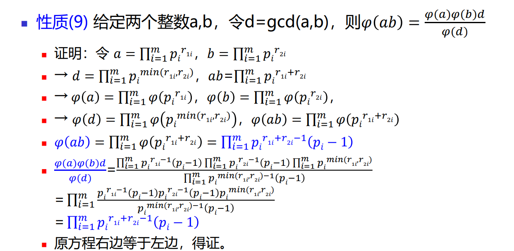

# 欧拉函数


## 定义：

给定正整数n，欧拉函数 φ(n)=不大于n且和n互质的正整数的 个数(包括1)。
$$
\sum_{i=1}^{n}[gcd(i,n)=1]
$$

##  代码

```cpp
#include<bits/stdc++.h>
using namespace std;
const int N = 1e6+10;
int p[N], phi[N], tot;
bool st[N];
void init() {
	phi[1] = st[1] = 1;
	for(int i=2; i<N; i++) {
		if(!st[i]) p[tot++] = i, phi[i] = i-1;
		for(int j=0; j<tot&&i*p[j]<N; j++) {
			st[i*p[j]] = 1;
			if(i % p[j] == 0) {
				phi[i*p[j]] = phi[i]*p[j];
				break;
			}
			phi[i*p[j]] = phi[i]*(p[j]-1);
		}
	}
}
int main() {
	return 0;
}
```


## 性质：

### +1:$gcd(i,n) = 1,gcd(n-i,n)=1$ 

### 1：$p$为素数，则 φ(p)=p-1

### 2：$p$是素数，正整数$n=p^k$,则$\phi(n) = p^k-p^{k-1}$，或写成$\phi(n) = p^{K-1}(p-1)=p^k(1-\frac 1p)$

证明

### 3：两个素数$p，q，n=pq$，则$\phi(n)=(p-1)*(q-1)$


### 3'：正整数$p，q$互质，n=pq，则$\phi(n)=\phi(p)\phi(q)$

性质：

$$
\sum_{d|n}\phi(d)=n
$$
证明：令$F(n)=\sum_{d|n}\phi(d)$ 

若$n=p^k$其中p为质数，因为n的因子有$1，p，p^2...p^k$ 所以$F(n)=\phi(1)+\phi(p)+\phi(p^2)...\phi(p^k)=1+p-1+p^2-p+...p^k-p^{k-1}=p$ 


证明$F(n)$是一个积性函数，假设$F(n)$是一个积性函数，那么m和n互质，则$F(m*n)=F(m)*F(n)$ 。

$F(m*n)\\=F(m)*F(n)\\=\sum_{i=1}^{k_m}\phi(d_{i_m})*\sum_{j=1}^{k_n}\phi(d_{j_n})$

因为m，n互质，所以它们的因子都互质，再因为$\phi(n)$是积性函数所以

$=\sum_{i=1}^{k_m}\sum_{j=1}^{k_n}\phi(d_{i_m}*d_{j_n})$

$d_{i_m}*d_{j_n}$包含了$n*m$全部的因子等价于$F(m*n)$

得证$F(n)$是一个积性函数


对于任意的n都存在唯一分解定理，所以得证：$\sum_{d|n}\phi(d)=n$


性质：
$$
gcd(i,n)=1则gcd(n-i,n)=1\\

\sum_{i=1}^ni*[gcd(i,n)=1]=n*\phi(n)/2
$$


性质：两个数a，b，最大公因数d。（对所有的积性函数都适用）
$$
\phi(ab)=\frac {\phi(a)\phi(b)d}{\phi(d)}
$$



## 题目：

### 	[1.SP5971 LCMSUM - LCM Sum](https://www.luogu.com.cn/problem/SP5971)


$$
\sum_{i = 1} ^{n} \frac{i}{gcd(i, n)}\\
\sum_{d \mid n} \sum_{i = 1} ^{n} \frac{i}{d}[gcd(i, n) = d]\\
\sum_{d \mid n} \sum_{i = 1} ^{\frac{n}{d}} i[gcd(i, \frac{n}{d}) = 1]\\
\sum_{d \mid n} \frac{(\phi(d) + [d = 1]) \times d}{2}\\
\frac 12((\sum_{d|n}\phi(d)d)+1)
$$

```cpp
/*
  Author : lifehappy
*/
#pragma GCC optimize(2)
#pragma GCC optimize(3)
#include <bits/stdc++.h>

#define mp make_pair
#define pb push_back
#define endl '\n'
#define mid (l + r >> 1)
#define lson rt << 1, l, mid
#define rson rt << 1 | 1, mid + 1, r
#define ls rt << 1
#define rs rt << 1 | 1

using namespace std;


typedef long long ll;
typedef unsigned long long ull;
typedef pair<int, int> pii;

const double pi = acos(-1.0);
const double eps = 1e-7;
const int inf = 0x3f3f3f3f;

inline ll read() {
    ll x = 0, f = 1; char c = getchar();
    while(c < '0' || c > '9') {
        if(c == '-') f = -1;
        c = getchar();
    }
    while(c >= '0' && c <= '9') {
        x = (x << 1) + (x << 3) + (c ^ 48);
        c = getchar();
    }
    return x * f;
}

const int N = 5e6 + 10;

int phi[N], n;

bool st[N];

vector<int> prime;

ll sum[N], ans[N];

void init() {
    st[0] = st[1] = 1;
    phi[1] = 1, sum[1] = 1;//注意把sum[1]置为1，特判。
    for(int i = 2; i < N; i++) {
        if(!st[i]) {
            prime.pb(i);
            phi[i] = i - 1;
            sum[i] = 1ll * i * phi[i] / 2;//计算(phi(i)+[i=1])*i/2
        }
        for(int j = 0; j < prime.size() && i * prime[j] < N; j++) {
            st[i * prime[j]] = 1;
            if(i % prime[j]) {
                phi[i * prime[j]] = phi[i] * (prime[j] - 1);
                sum[i * prime[j]] = 1ll * phi[i * prime[j]] * (i * prime[j]) / 2;
            }
            else {
                phi[i * prime[j]] = phi[i] * prime[j];
                sum[i * prime[j]] = 1ll * phi[i * prime[j]] * (i * prime[j]) / 2;
                break;
            }
        }
    }
    for(int i = 1; i < N; i++) {
        for(int j = i; j < N; j += i) {
            ans[j] += sum[i];
        }
    }
}  

int main() {
    // freopen("in.txt", "r", stdin);
    // freopen("out.txt", "w", stdout);
    ios::sync_with_stdio(false), cin.tie(0), cout.tie(0);
    init();
    n = read();
    for(int i = 1; i <= n; i++)
        cout << ans[i] << "\n";
	return 0;
}
```

### 1+.[1363 最小公倍数之和(进阶)](http://www.51nod.com/Challenge/Problem.html#problemId=1363)

解法1：

```
#include<bits/stdc++.h>
using namespace std;
typedef long long ll;
const int N = 1e6+7;
const int mod = 1e9+7;
int p[N], tot, cnt;
bool st[N];
ll d[N], c[N], ans = 0;

void init() {//筛出素数
    for(int i=2; i<N; i++) {
        if(!st[i]) p[tot++] = i;
        for(int j=0; j<tot&&i*p[j]<N; j++) {
            st[i*p[j]] = 1;
            if(i % p[j] == 0) break;
        }
    }
}

//x表示枚举到n的第x个质因子，y表示当前因子小，z表因子的欧拉函数值。
void dfs(int x, int y, int z) {
    if(x == cnt+1) {
        if(y != 1) ans = (ans + 1ll*y*z/2%mod) % mod;
        else ans = (ans + 1) % mod;
        return ;
    }
    dfs(x+1, y, z);//不选择这个质因子。

    y = y*d[x]%mod, z = z*(d[x]-1)%mod;//选择一次质因子。
    dfs(x+1, y, z);
    //循环选择
    for(int i=2; i<=c[x]; i++) y = y*d[x]%mod , z = z*d[x]%mod, dfs(x+1, y, z);
}

int main() {
    init();
    int t;
    cin >> t;
    while(t--) {
        int n, x;
        cin >> n;
        cnt = 0, x = n, ans = 0;
        //将n的全部质因子筛出来。
        for(int i=0; 1ll*p[i]*p[i]<=x; i++) {
            if(x % p[i] == 0) {
                d[++cnt] = p[i], c[cnt] = 0;
                while(x % p[i] == 0) c[cnt]++, x /= p[i];
            }
        }
        if(x > 1) d[++cnt] = x, c[cnt] = 1;
        // 求出ans
        dfs(1, 1, 1);
        cout << ans * n % mod << endl;;
    }
    return 0;
}
```

[解法2:](https://www.cnblogs.com/henry-1202/p/10673353.html)


```cpp
#include<bits/stdc++.h>
using namespace std;
typedef long long ll;
const int N = 1e6+10;
const int mod = 1e9+7;
const int inv2 = (mod+1)/2;
int p[N], tot;
bool st[N];
void init() {//欧拉筛
    for(int i=2; i<N; i++) {
        if(!st[i]) p[tot++] = i;
        for(int j=0; j<tot&&i*p[j]<N; j++) {
            st[i*p[j]] = 1;
            if(i % p[j] == 0) break;
        }
    }
}

int solve(int n) {//筛出n的每个素数，然后求对应的f(p^k),再乘起来;
    ll ans = 1;
    for(int i=0; 1ll*p[i]*p[i]<=n; i++) {
        if(n % p[i] == 0) {
            ll now = 1, sum = 1;
            while(n % p[i] == 0) {
                n /= p[i]; 
                now *= 1ll*p[i];
                sum = (sum + (1ll*now-now/p[i])*now%mod) % mod;
            }
            ans = ans * sum % mod;
        } 
    }
    if(n > 1) ans = ans * (1+1ll*(n-1)*n%mod) % mod; 
    return (ans+1)%mod;
}
int main() {
#ifndef ONLINE_JUDGE 
    freopen("in.txt", "r", stdin);
    freopen("out.txt", "w", stdout);
#endif
    init(); 
    int t;
    cin >> t;
    while(t--) {
        int n;
        cin >> n;
        cout << 1ll*solve(n)*n%mod*inv2%mod << endl;
    }
    return 0;
} 
```


### 2

$$
1.\sum_{i=1}^n[gcd(i, n)>=m]\\=\sum_{d|n}\sum_{i=1}^n[gcd(i,n)=d][d>=m]\\=\sum_{d|n}[d>=m]\sum_{i=1}^n[gcd(i,n)=d]\\=\sum_{d|n}[d>=m]\sum_{i=1}^{\frac{n}{d}}[gcd(i,\frac{n}{d})=1]\\=\sum_{d|n}[d>=m]*\phi(\frac{n}{d})\\
$$


### 3


$$
\sum_{i=1}^ngcd(i,n)\\
=\sum_{d|n}d*\sum_{i=1}^{\frac{n}{d}}[gcd(i,\frac{n}{d})=1]\\=\sum_{d|n}d*\phi(\frac{n}{d})\\
$$


### 4


$$
\sum_{i=1}^n[gcd(i,n)>1]i\\
=\sum_{i=1}^ni-\sum_{i=1}^n[gcd(i,n)=1]i\\
=\frac {(n+1)*n}2-\frac {n\phi(n)}2
$$


### 5

$$
\sum_{i=1}^n\frac{i}{gcd(i,n)}\\
=\sum_{d|n}\sum_{i=1}^n\frac id[gcd(i,n)=d]\\
=\sum_{d|n}\sum_{j=1}^{\frac nd}\frac {jd}d[gcd(j,\frac nd)=1]\\
=\sum_{d|n}\frac {\frac nd (\phi(\frac nd)+[\frac nd=1])}{2}\\
=\sum_{d|n}\frac {d(\phi(d)+[d=1])}2
$$

### 6

$$
\sum_{i=1}^{n}\sum_{j=1}^{n}[gcd(i,j)=1]\\=2*\sum_{i=1}^{n}\phi(i)-1 \\
$$


### 7

$$
\sum_{i=1}^{n}\sum_{j=1}^{n}gcd(i, j)\\
$$


### 8


$$
\sum_{i\in prime}\sum_{j=1}^{n}\sum_{k=1}^{n}[gcd(j,k)=i]\\=\sum_{i\in prime}\sum_{j=1}^{\frac{n}{i}}\sum_{k=1}^{\frac{n}{i}}[gcd(j,k)=1]\\=\sum_{i\in prime}((2*\sum_{j=1}^{\frac{n}{i}}\phi(j))-1)\\
$$

### [Goffi and GCD](http://acm.hdu.edu.cn/showproblem.php?pid=4983)

$$
8.\sum_{i=1}^n\sum_{j=1}^{n}[gcd(n-i,n)gcd(n-j,n)=n^k],求(i,j)的方案数。\\
\sum_{i=1}^n\sum_{j=1}^n\sum_{x|n}\sum_{y|n}[xy=n][gcd(n-i,n)=x][gcd(n-j,n)=y]\\
\sum_{x|n}\sum_{y|n}[xy=n]\sum_{i=1}^n[gcd(i,n)=x]\sum_{j=1}^n[gcd(j,n)=x]\\
\sum_{x|n}\sum_{y|n}[xy=n]\phi(\frac nx)\phi(\frac ny)\\
\sum_{x|n}\phi(\frac nx)\phi(x)\\
$$


​	


### [Count a \* b](http://acm.hdu.edu.cn/showproblem.php?pid=5528)

题意：有$t$组输入，每组输入入一个数$n(n\leq 10^9)$，求$g(n) = \sum_{m|n}f(m)$，$f(m)=\sum_{i=0}^{m-1}\sum_{j=0}^{m-1}[i\times j \%m != 0]$。

推式子：
$$
f(m)=\sum_{i=0}^{m-1}\sum_{j=0}^{m-1}[i\times j ~\%~m \neq 0]\\
=\sum_{i=1}^m\sum_{j=1}^m[i\times j ~\%~ m \neq0]\\
=m^2-\sum_{i=1}^m\sum_{j=1}^m[i\times j ~\%~ m =0]\\
=m^2-\sum_{i=1}^m\sum_{j=1}^m[m|i\times j]\\
=m^2-\sum_{i=1}^m\sum_{j=1}^m[\frac m{gcd(i,m)}|\frac i{gcd(i,m)}\times j]\\
=m^2-\sum_{i=1}^m\frac m{\frac m {gcd(i, m)}}\\
=m^2-\sum_{i=1}^mgcd(i,m)\\
=m^2-\sum_{d|m}\sum_{i=1}^m[gcd(i,m)=d]\\
=m^2-\sum_{d|m}d\sum_{i=1}^{\frac md}[gcd(i, \frac md)=1]\\
=m^2-\sum_{d|m}d\phi(\frac md)\\
$$
1.$\sum_{i=0}^{m-1}\sum_{j=0}^{m-1}[i\times j ~\%~m \neq 0]
=\sum_{i=1}^m\sum_{j=1}^m[i\times j ~\%~ m \neq0]$

当$i=0$和$i=n$的时候，$i\times j\%m=0$,同样$j=0$和$j=1$的时候$i\times j\%m=0$

2.$\sum_{i=1}^m\sum_{j=1}^m[\frac m{gcd(i,m)}|\frac i{gcd(i,m)}\times j]
=\sum_{i=1}^m\frac m{\frac m {gcd(i, m)}}\\$.

$\frac m{gcd(i, m)}$和$\frac i {gcd(i,m)}$是互质的，所以$\sum_{i=1}^m\sum_{j=1}^m[\frac m{gcd(i,m)}|\frac i{gcd(i,m)}\times j]=\sum_{i=1}^m\sum_{j=1}^m[\frac m{gcd(i,m)}|j]$，等价于在区间[1,m]中有多少个$\frac m {gcd(i,m)}$的倍数，就是$\frac m{\frac m {gcd(i, m)}}$。


$$
g(n) = \sum_{m|n}f(m)\\
=\sum_{m|n}m^2-\sum_{m|n}\sum_{d|m}d\phi(\frac md)\\
=\sum_{m|n}m^2-\sum_{d|n}d\sum_{m|n,d|m}\phi(\frac md)\\
=\sum_{m|n}m^2-\sum_{d|n}d\sum_{k|\frac nd}\phi(k)\\
=\sum_{m|n}m^2-\sum_{d|n}n
$$
1.$\sum_{m|n}\sum_{d|m}d\phi(\frac md)=\sum_{d|n}d\sum_{m|n,d|m}\phi(\frac md)=\sum_{d|n}d\sum_{k|\frac nd}\phi(k)\\$

我们把d提出去，d是m的因子，m是n的因子，所以d是n的因子。

m是n的因子，d是m的因子，我们从m和n中都提出一个d，就可以得到$\frac md$是$\frac nd$的因子。


思路：

1.考虑暴力：$t\leq 20000，n\leq 10^9$，枚举全部的因子$O(t\sqrt n)$复杂度太高。

2.唯一分解定理：$x=\prod_{i=1}^{k}p_i^{e_i}$。

​	x的因子个数=$\prod_{i=1}^k(e_i+1)$。

​	x的因子和=$\prod_{i=1}^k(1+p_i^1+p_i^2...p_i^{e_i})$。

​	x的因子平方和=$\prod_{i=1}^k(1+p_i^2+p_i^4...p_i^{2e_i})$。

$Code$

```cpp
#include<bits/stdc++.h>
using namespace std;
typedef unsigned long long ull;
const int N = 1e5+10;
ull p[N], tot;
bool st[N];
//初始化求欧拉函数。
void init() {
    for(int i=2; i<N; i++) {
        if(!st[i]) p[tot++] = i;
        for(int j=0; j<tot&&i*p[j]<N; j++) {
            st[i*p[j]] = 1;
            if(i % p[j] == 0) break;
        }
    }
}
//快速幂
ull qpow(ull x, int y) {
    ull ans = 1;
    while(y) {
        if(y & 1) ans = ans * x;
        x = x * x;
        y >>= 1;
    }
    return ans;
}
int main() {
#ifndef ONLINE_JUDGE
    freopen("in.txt", "r", stdin);
    freopen("out.txt", "w", stdout);
#endif
    init();
    int t;
    cin >> t;
    while(t--) {
        //ans表示n的因子平方和，sum表示n的因子个数。
        ull n, m, ans = 1, sum = 1;
        scanf("%llu", &n);
        m = n;
        //分解质因子
        for(int i=0; i<tot&&p[i]*p[i]<=n; i++) {
            if(n % p[i]) continue;//不是n的因子
            ull k = 0;
            while(n % p[i] == 0) k++, n /= p[i];
            //等差数列求和
            ull res = 1+p[i]*p[i]*((qpow(p[i],2*k)-1)/(p[i]*p[i]-1));
            
            ans *= res;
            sum *= (k+1);
        }
        //判断n是否全部分解。
        if(n > 1) {
            ans *= 1ull+n*n;
            sum *= 2ull;
        }
        printf("%llu\n", ans-sum*m);
    }
    return 0;
}
```


$$
在1-n中\\
\sum_{i|n}1是求n的因子数\\
\sum_{x|i}1是求1-n中有多少x的倍数。=\frac{n}{x}\\

\sum_{i=1}^{n}\sum_{x|i}1=\sum_{x=1}^{n}\lfloor\frac{n}{x}\rfloor\\
大白话：对于每个i，求它的因子个数=对于每个因子求它的倍数个数。\\
$$


### [P4917 天守阁的地板](https://www.luogu.com.cn/problem/P5221)

$$
\prod_{i=1}^n\prod_{j=1}^n\frac{ij}{gcd^2(i,j)}\\
$$


```cpp
#include <bits/stdc++.h>
using namespace std;

typedef long long ll;
#define int long long
#define double long double
const int N = 1e6 + 10;
const int mod = 19260817;
const double eps = 1e-2;
int p[N], phi[N], tot;
bool st[N];
int ty[N];
void init() {
    phi[1] = 1, ty[1] = ty[0] = 1;
    for(int i=2; i<N; i++) {
        ty[i] = ty[i-1] * i % mod;
        if(!st[i]) p[tot++] = i, phi[i] = i-1;
        for(int j=0; j<tot&&i*p[j]<N; j++) {
            st[i*p[j]] = 1;
            if(i % p[j] == 0) {
                phi[i*p[j]] = phi[i] * p[j];
                break;
            }
            phi[i*p[j]] = phi[i] * phi[p[j]];
        }
    }
    for(int i=1; i<N; i++) {
        phi[i] = (phi[i] + phi[i-1]) % (mod-1);
    }
}
int qpow(int x, int y) {
    int ans = 1;
    while(y) {
        if(y & 1) ans = ans * x % mod;
        x = x * x % mod;
        y >>= 1;
    }
    return ans;
}

void C(int n) {
    int ans = qpow(ty[n], 2ll*n+2);
    int hou = 1;
    for(int i=1, j; i<=n; i=j+1) {
        j = (n/(n/i));
        hou = hou * qpow(ty[j] * qpow(ty[i-1], mod-2) % mod, 4ll*phi[n/i]%(mod-1)) % mod;
    }
    cout << ans * qpow(hou, mod-2) % mod << endl;
}

signed main() {
#ifndef ONLINE_JUDGE
    freopen("in.txt", "r", stdin);
    freopen("out.txt", "w", stdout);
#endif
    init();
    int t;
    scanf("%lld", &t);
    while(t--) {
        int n;
        scanf("%lld", &n);
        C(n);
    }
}
```


